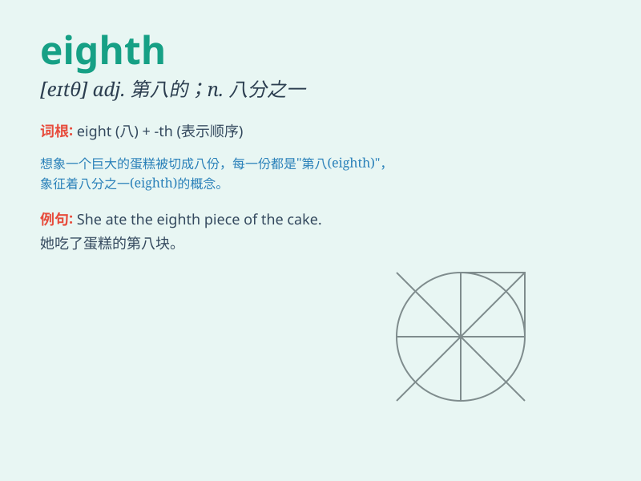

## eighth

**英音:** _[eɪtθ]_ **美音:** _[etθ]_

**译义:** * num.第八*

### 短语

+ **eighth note:** _八分音符_

+ **the eighth wonder:** _第八大奇迹_

+ **eighth grade:** _八年级_

+ **eighth month:** _第八个月_

+ **eighth place:** _第八名_

### 例句

#### 例句1

> **He finished eighth in the race.**

**中文翻译:** 他在比赛中获得第八名。

**单词释义:** 第八

#### 例句2

> **This is my eighth attempt to solve this problem.**

**中文翻译:** 这是我第八次尝试解决这个问题。

**单词释义:** 第八

#### 例句3

> **The eighth chapter of this book is very interesting.**

**中文翻译:** 这本书的第八章很有趣。

**单词释义:** 第八

### 背诵小故事

> One day, a little mouse was trying to find its eighth piece of
cheese. It searched everywhere and finally found it behind the eighth
door. Now it was so happy!

**有一天，一只小老鼠试图找到它的第八块奶酪。它到处寻找，最后在第八扇门后面找到了。现在它非常开心！**

### 图义

