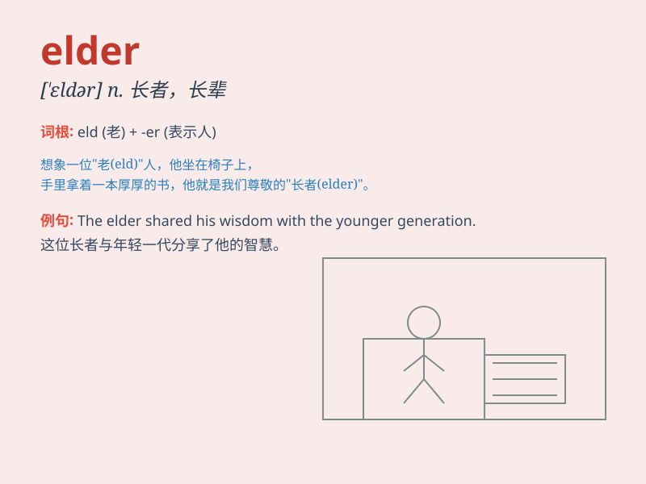

## elder

**英音:** _[\'eldə]_ **美音:** _[\'ɛldɚ]_

**译义:** *n.年长者,老人,父辈adj.年长的,资格老的,*

### 短语

+ **elder brother:** _哥哥_

+ **elder sister:** _姐姐_

+ **elder statesman:** _政界元老；资深政治家_

+ **elder care:** _老年人护理_

+ **elder tree:** _接骨木_

### 例句

#### 例句1

> **My elder sister is very kind to me.**

**中文翻译:** 我的姐姐对我非常好。

**单词释义:** 年长的（指兄弟姐妹中的）

#### 例句2

> **The elder of the two brothers is a doctor.**

**中文翻译:** 两兄弟中年纪较大的那个是医生。

**单词释义:** 较年长的

#### 例句3

> **Elder people need more care and attention.**

**中文翻译:** 年长的人需要更多的关心和照顾。

**单词释义:** 年长的

### 背诵小故事

> Once upon a time, there were two brothers. The older one was always
responsible and took care of the younger. We call the older brother
\'elder\'. So, remember, \'elder\' means an older person, especially
within a family.

**从前，有两兄弟。年长的那个总是很有责任心，照顾着年幼的。我们把年长的那位称作"elder"。所以，记住，"elder"指年龄较大的人，尤其在家庭中。**

### 图义

