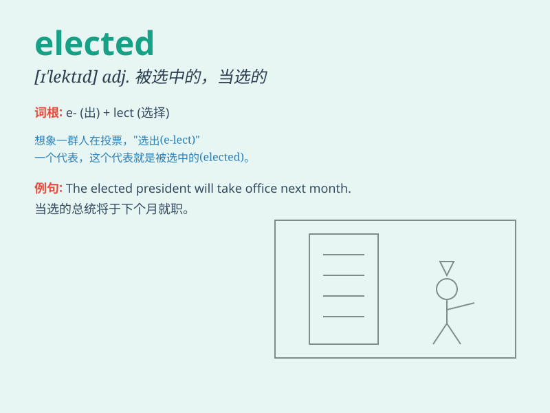

## elected

**英音:** _[ɪˈlektɪd]_ **美音:** _[ɪˈlektɪd]_

**译义:**
*被选举的；当选的（这是动词elect的过去分词形式，通常用作形容词，指通过投票或选举程序获得职位的人）*

### 短语

+ **elected representative:** _民选代表_

+ **elected official:** _当选官员_

+ **elected body:** _选举产生的机构_

+ **elected position:** _当选职位_

+ **elected member:** _当选成员_

### 例句

#### 例句1

> **He was elected as the president of the company.**

**中文翻译:** 他被选为公司的总裁。

**单词释义:** 被选为

#### 例句2

> **The newly elected mayor promised to improve the city\'s
infrastructure.**

**中文翻译:** 新当选的市长承诺改善城市的基础设施。

**单词释义:** 新当选的

#### 例句3

> **She was elected to the school board last year.**

**中文翻译:** 她去年被选进了学校董事会。

**单词释义:** 被选进

### 背诵小故事

> One day, in a small town, people were choosing their leader. After a
fair vote, a kind and wise man was elected. Everyone was happy because
they believed he would do great things for the town.

**有一天，在一个小镇上，人们正在选举他们的领导人。经过公平投票，一位善良且睿智的人被选上了。每个人都很高兴，因为他们相信他会为小镇做很多好事。**

### 图义

