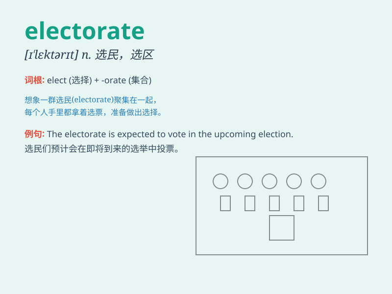

## electorate

**英音:** _[ɪ\'lekt(ə)rət]_ **美音:** _[ɪ\'lɛktərət]_

**译义:** *n.选民,选区,有选举权者*

### 短语

+ **the general electorate:** _全体选民_

+ **registered electorate:** _登记选民_

+ **voting electorate:** _投票选民_

+ **electorate size:** _选民规模_

+ **electorate composition:** _选民构成_

### 例句

#### 例句1

> **The electorate is becoming increasingly disillusioned with the
political system.**

**中文翻译:** 选民对政治制度越来越失望。

**单词释义:** 全体选民

#### 例句2

> **The government needs to win the support of the electorate.**

**中文翻译:** 政府需要赢得选民的支持。

**单词释义:** 全体选民

#### 例句3

> **The views of the electorate on this issue are diverse.**

**中文翻译:** 选民对这个问题的看法多种多样。

**单词释义:** 全体选民

### 背诵小故事

> In a small town, the electorate was excited for the big election.
They were the people with the power to choose their leader. Everyone was
discussing and making their decisions carefully. The fate of the town
lay in the hands of this electorate.

**在一个小镇上，全体选民对大型选举感到兴奋。他们是有权选择领导人的人。每个人都在认真讨论并做出决定。这个小镇的命运掌握在这些选民手中。**

### 图义

