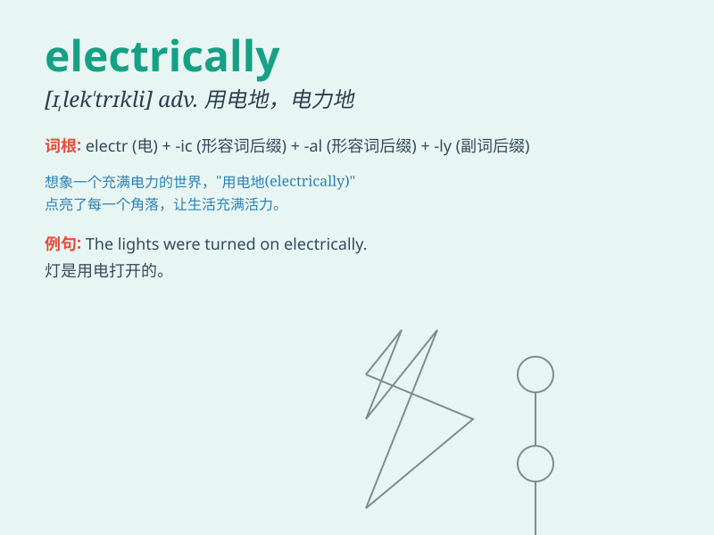

## electrically

**英音:** _[ɪˈlɛktrɪkəli]_ **美音:** _[ɪˈlɛktrɪkəli]_

**译义:** *adv.电力地,有关电地*

### 短语

+ **electrically charged:** _带电的_

+ **electrically operated:** _电动操作的_

+ **electrically conductive:** _导电的_

+ **electrically insulated:** _电绝缘的_

+ **electrically stimulated:** _电刺激的_

### 例句

#### 例句1

> **The machine is operated electrically.**

**中文翻译:** 该机器是电动操作的。

**单词释义:** 以电的方式

#### 例句2

> **The door opened electrically.**

**中文翻译:** 门是电动打开的。

**单词释义:** 通过电

#### 例句3

> **The signal is transmitted electrically.**

**中文翻译:** 信号通过电传输。

**单词释义:** 用电

### 背诵小故事

> A brave scientist was conducting experiments electrically. One day, a
sudden power surge occurred, but he remained calm and fixed the problem.
This incident helped him remember the importance of being electrically
cautious.

**一位勇敢的科学家正在进行电学实验。有一天，突然出现了电涌，但他保持冷静并解决了问题。这件事帮助他记住了电学方面谨慎的重要性。**

### 图义

