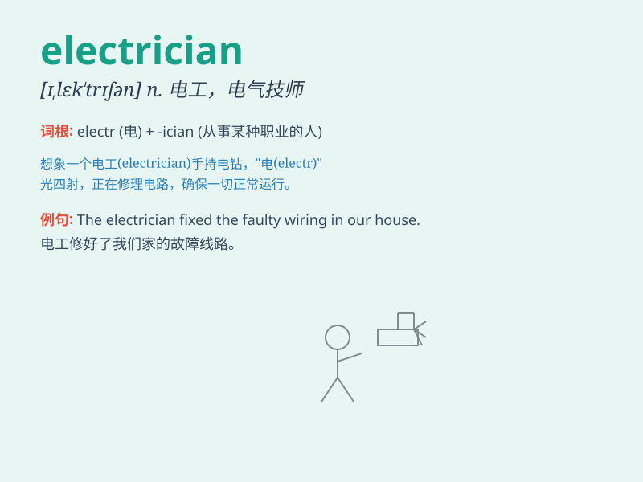

## electrician

**英音:** _[,ɪlek\'trɪʃ(ə)n; ,el-; ,iːl-]_ **美音:**
_[ɪ\'lɛk\'trɪʃən]_

**译义:** *n.电工,电学家*

### 短语

+ **licensed electrician:** _有执照的电工_

+ **experienced electrician:** _经验丰富的电工_

+ **qualified electrician:** _合格的电工_

+ **professional electrician:** _专业电工_

+ **master electrician:** _电工大师_

### 例句

#### 例句1

> **The electrician came to fix the wiring in our house.**

**中文翻译:** 电工来修理我们家的电线。

**单词释义:** 电工

#### 例句2

> **We need to call an electrician to install the new light
fixtures.**

**中文翻译:** 我们需要请电工来安装新的灯具。

**单词释义:** 电工

#### 例句3

> **The electrician checked the electrical panel for any faults.**

**中文翻译:** 电工检查了配电板是否有任何故障。

**单词释义:** 电工

### 背诵小故事

> One day, the power went out in the city. An electrician came quickly.
He had a toolbox and knew all about wires and circuits. With his skills,
he fixed the problem and brought light back. Everyone thanked the
electrician.

**有一天，城市停电了。一位电工迅速赶来。他带着一个工具箱，熟知电线和电路。凭借他的技能，他解决了问题，让光明重现。大家都感谢这位电工。**

### 图义

