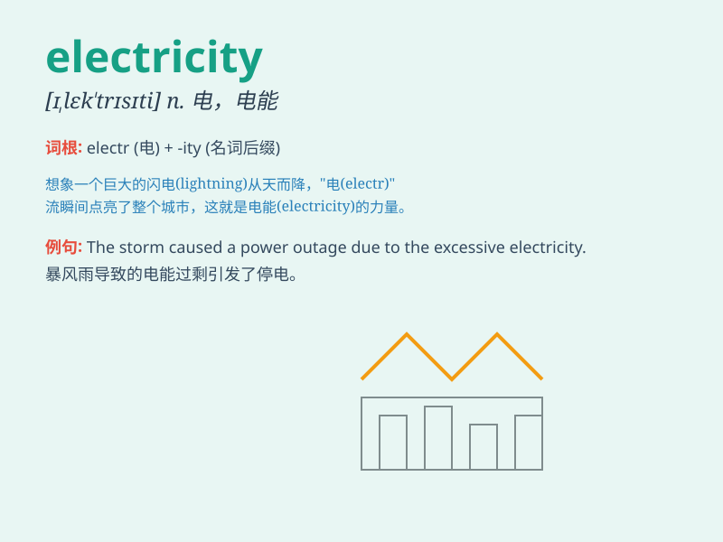

## electricity

**英音:** _[,ɪlek\'trɪsɪtɪ; ,el-; ,iːl-]_ **美音:**
_[ɪ\'lɛk\'trɪsəti]_

**译义:** *n.电流,电,电学*

### 短语

+ **generate electricity:** _发电_

+ **electricity bill:** _电费账单_

+ **electricity supply:** _电力供应_

+ **cut off electricity:** _断电_

+ **electricity consumption:** _电力消耗_

### 例句

#### 例句1

> **The city experienced a power outage due to problems with the
electricity supply.**

**中文翻译:** 由于电力供应问题，该市遭遇停电。

**单词释义:** 电；电力

#### 例句2

> **We need to pay the electricity bill before the due date.**

**中文翻译:** 我们需要在到期日之前支付电费。

**单词释义:** 电；电力

#### 例句3

> **The factory uses a large amount of electricity to operate its
machines.**

**中文翻译:** 该工厂使用大量电力来运行机器。

**单词释义:** 电；电力

### 背诵小故事

> One night, the whole city was plunged into darkness. But soon,
electricity was restored, and lights came back on. The power of
electricity made everything normal again. It\'s like a magic force that
keeps our lives running.

**一天晚上，整个城市陷入黑暗。但很快，电恢复了，灯又亮了。电的力量让一切再次恢复正常。它就像一种神奇的力量，维持着我们的生活运转。**

### 图义

