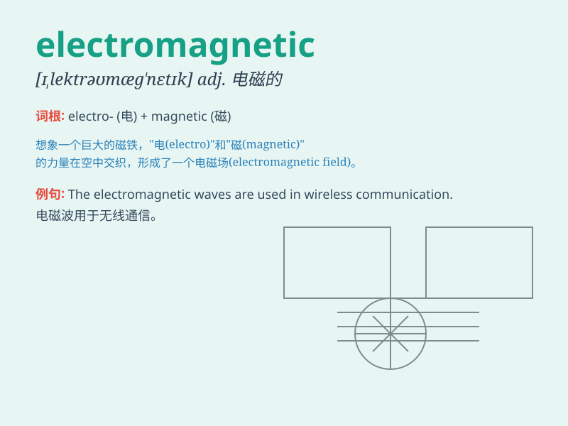

## electromagnetic

**英音:** _[ɪ,lektrə(ʊ)mæg\'netɪk]_ **美音:**
_[ɪ,lɛktromæɡ\'nɛtɪk]_

**译义:** *
/n.[电磁]cs/I9lektrEJmA\^\`sm/IlektrEJ5mA\^ntIk/adj.电磁的*

### 短语

+ **electromagnetic field:** _电磁场_

+ **electromagnetic radiation:** _电磁辐射_

+ **electromagnetic induction:** _电磁感应_

+ **electromagnetic wave:** _电磁波_

+ **electromagnetic force:** _电磁力_

### 例句

#### 例句1

> **Electromagnetic waves can travel through a vacuum.**

**中文翻译:** 电磁波可以在真空中传播。

**单词释义:** 电磁的

#### 例句2

> **The electromagnetic field around the power line is strong.**

**中文翻译:** 电线周围的电磁场很强。

**单词释义:** 电磁的

#### 例句3

> **Electromagnetic interference can affect the performance of
electronic devices.**

**中文翻译:** 电磁干扰会影响电子设备的性能。

**单词释义:** 电磁的

### 背诵小故事

>
想象一下，在一个神秘的实验室里，电子们欢快地跳舞（electron），磁体们也在尽情表演（magnetic），它们共同组成了神奇的电磁现象，这就是electromagnetic。

**想象电子和磁体共同组成电磁现象来辅助记忆electromagnetic这个单词**

### 图义

