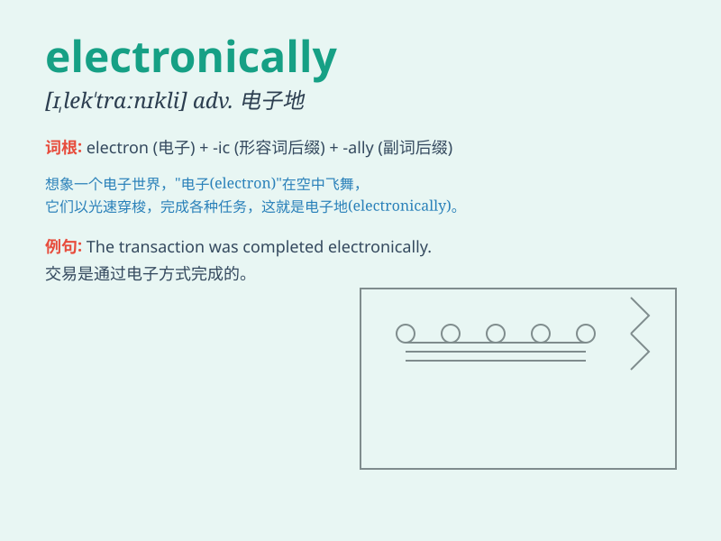

## electronically

**英音:** _[ɪˌlekˈtrɒnɪkli]_ **美音:**
_[ɪˌlekˈtrɑːnɪkli]_

**译义:** *adv.电子地*

### 短语

+ **electronically controlled:** _电子控制的_

+ **electronically signed:** _电子签名的_

+ **electronically stored:** _电子存储的_

+ **electronically delivered:** _电子交付的_

+ **electronically monitored:** _电子监控的_

### 例句

#### 例句1

> **The document was signed electronically.**

**中文翻译:** 这份文件是以电子方式签署的。

**单词释义:** 以电子方式

#### 例句2

> **The money was transferred electronically to his account.**

**中文翻译:** 这笔钱通过电子方式转到了他的账户上。

**单词释义:** 通过电子方式

#### 例句3

> **She communicates with her friends electronically almost every
day.**

**中文翻译:** 她几乎每天都通过电子方式和朋友们交流。

**单词释义:** 通过电子方式

### 背诵小故事

> One day, a scientist was conducting an experiment electronically. He
controlled all the devices and collected data through advanced
electronic systems. It was amazing how everything worked so precisely
and efficiently electronically.

**有一天，一位科学家正在以电子方式进行实验。他通过先进的电子系统控制所有设备并收集数据。一切以电子方式如此精确和高效地运作，真是令人惊叹。**

### 图义

