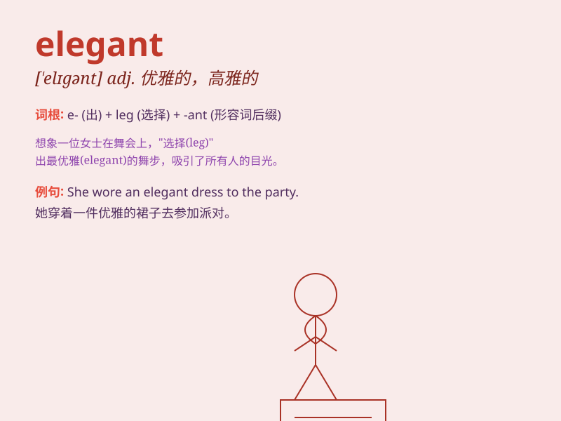

## elegant

**英音:** _[\'elɪg(ə)nt]_ **美音:** _[\'ɛləgənt]_

**译义:** *adj.文雅的,端庄的,雅致的,\<口>上品的,第一流的*

### 短语

+ **elegant style:** _优雅的风格_

+ **elegant dress:** _优雅的连衣裙_

+ **elegant solution:** _优雅的解决方案_

+ **elegant manner:** _优雅的举止_

+ **elegant appearance:** _优雅的外表_

### 例句

#### 例句1

> **She wore an elegant black dress to the party.**

**中文翻译:** 她穿着一件优雅的黑色连衣裙去参加聚会。

**单词释义:** 优雅的（形容衣服）

#### 例句2

> **The hotel has an elegant lobby with marble floors.**

**中文翻译:** 这家酒店有一个铺着大理石地板的优雅大堂。

**单词释义:** 优雅的（形容场所）

#### 例句3

> **His elegant writing style sets him apart from other authors.**

**中文翻译:** 他优雅的写作风格使他有别于其他作者。

**单词释义:** 优雅的（形容写作风格）

### 背诵小故事

> A princess attended a grand ball. She wore a beautiful dress and
moved gracefully. Everyone said she was elegant. Her every step and
gesture showed charm and refinement.

**一位公主参加了盛大的舞会。她身着漂亮的裙子，举止优雅。每个人都说她很优雅。她的每一步和每一个姿态都展现出魅力和高雅。**

### 图义

