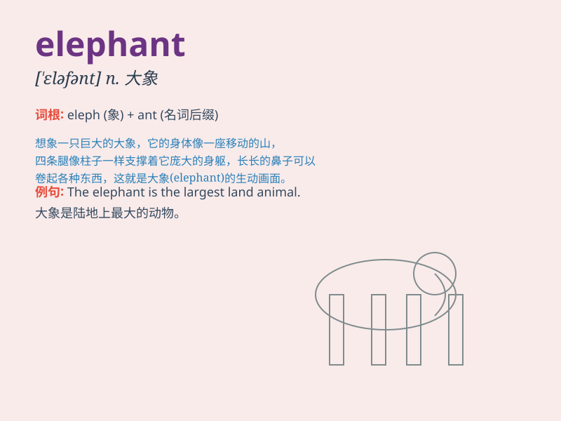

## elephant

**英音:** _[\'elɪf(ə)nt]_ **美音:** _[ˈɛləfənt]_

**译义:** *n.象,一种纸张的尺寸*

### 短语

+ **white elephant:** _昂贵而无用的东西_

+ **elephant seal:** _象海豹_

+ **elephant trunk:** _象鼻_

+ **see the elephant:** _见世面；开眼界_

+ **elephant in the room:** _（人们不愿提及的）棘手问题_

### 例句

#### 例句1

> **The elephant is a huge animal.**

**中文翻译:** 大象是一种巨大的动物。

**单词释义:** 大象

#### 例句2

> **We saw an elephant at the zoo.**

**中文翻译:** 我们在动物园看到了一头大象。

**单词释义:** 大象

#### 例句3

> **The elephant has a long trunk.**

**中文翻译:** 大象有一个长长的鼻子。

**单词释义:** 大象

### 背诵小故事

> Once upon a time, there was a little elephant. It was very cute but
always got lost. One day, it found its way home with the help of
friendly birds. From then on, it never got lost again.

**从前，有一只小象。它非常可爱但总是迷路。有一天，在友好的鸟儿的帮助下它找到了回家的路。从那以后，它再也没有迷路了。**

### 图义

