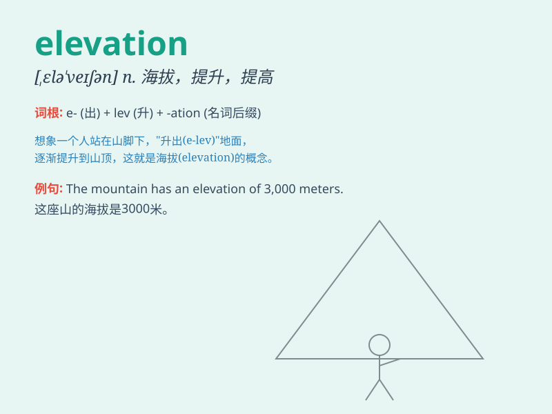

## elevation

**英音:** _[,elɪ\'veɪʃ(ə)n]_ **美音:** _[,ɛlɪ\'veʃən]_

**译义:** *n.上升,高地,正面图,海拔,提高,仰角,崇高,壮严*

### 短语

+ **elevation angle:** _仰角_

+ **elevation difference:** _高差；高度差_

+ **elevation drawing:** _立面图_

+ **elevation of ground:** _地面高程_

+ **elevation view:** _正视图；立视图_

### 例句

#### 例句1

> **The elevation of the mountain peak is over 8,000 meters.**

**中文翻译:** 山峰海拔8000多米。

**单词释义:** 海拔；高度

#### 例句2

> **The new building has an elevation that makes it stand out in the
city skyline.**

**中文翻译:** 新建筑的海拔使其在城市天际线上脱颖而出。

**单词释义:** 高度；海拔

#### 例句3

> **The engineer studied the elevation of the land before starting
the construction project.**

**中文翻译:** 工程师在开始建设项目之前研究了土地的标高。

**单词释义:** （土地的）地势

### 背诵小故事

> A brave climber was determined to reach the top of the mountain for
the ultimate elevation experience. After a long and tough journey, he
finally stood at the peak and enjoyed the breathtaking view.

**一位勇敢的登山者决心到达山顶以获得终极的海拔体验。经过漫长而艰难的旅程，他终于站在了山顶，欣赏到了令人惊叹的景色。**

### 图义

