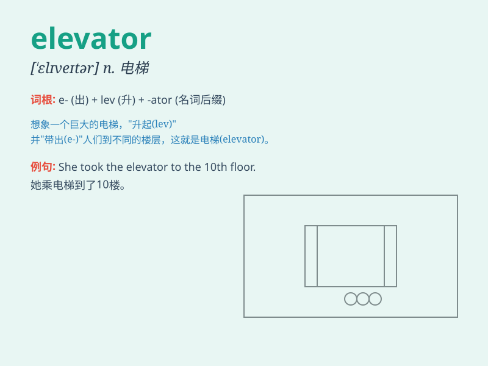

## elevator

**英音:** _[\'elɪveɪtə]_ **美音:** _[\'ɛlɪvetɚ]_

**译义:** *n.电梯,升降机,[空]升降舵*

### 短语

+ **elevator shaft:** _电梯井_

+ **elevator music:**
_电梯音乐（在电梯等场所播放的平淡的背景音乐）_

+ **passenger elevator:** _乘客电梯_

+ **service elevator:** _服务电梯；货梯_

+ **elevator door:** _电梯门_

### 例句

#### 例句1

> **I took the elevator to the tenth floor.**

**中文翻译:** 我乘电梯到了十楼。

**单词释义:** 电梯

#### 例句2

> **The elevator is out of order. We have to use the stairs.**

**中文翻译:** 电梯坏了。我们必须使用楼梯。

**单词释义:** 电梯

#### 例句3

> **She got stuck in the elevator for half an hour.**

**中文翻译:** 她在电梯里被困了半个小时。

**单词释义:** 电梯

### 背诵小故事

> One day, Tom was in a tall building. He was late for a meeting.
Luckily, he found the elevator and quickly got in. It took him to the
right floor in no time. The elevator saved him!

**有一天，汤姆在一座高楼里。他开会要迟到了。幸运的是，他找到了电梯并迅速进去。电梯很快就把他带到了正确的楼层。电梯救了他！**

### 图义

