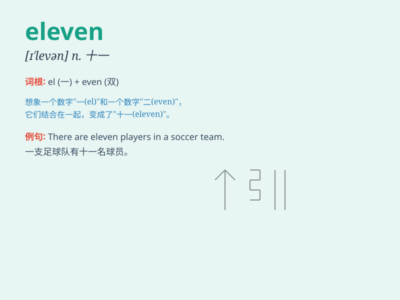

## eleven

**英音:** _[ɪ\'lev(ə)n]_ **美音:** _[ɪ\'lɛvn]_

**译义:** *n.十一*

### 短语

+ **eleven o\'clock:** _十一点钟_

+ **at eleven:** _在十一点_

+ **eleven plus:** _（英国的）11 岁以上儿童考试_

+ **group of eleven:** _十一人群体_

+ **eleven members:** _十一名成员_

### 例句

#### 例句1

> **There are eleven people in the room.**

**中文翻译:** 房间里有十一个人。

**单词释义:** 十一（数字）

#### 例句2

> **She was eleven years old last year.**

**中文翻译:** 去年她十一岁。

**单词释义:** 十一（年龄）

#### 例句3

> **The meeting starts at eleven o\'clock.**

**中文翻译:** 会议于十一点开始。

**单词释义:** 十一点（时间）

### 背诵小故事

> 有一天，小汤姆在数数字，当他数到 11
的时候怎么也记不住。妈妈告诉他，你看 e 就像一个人的身体，l 是两条腿，ven
发音类似'问'，想象一个人用两条腿站着问别人这是不是 11 呀，这样就能记住
eleven 啦。

**有一天，小汤姆在数数字，当数到 11
记不住时，妈妈通过形象的比喻帮助他记忆，即一个人用两条腿站着问是不是
11，从而记住 eleven 这个单词。**

### 图义

