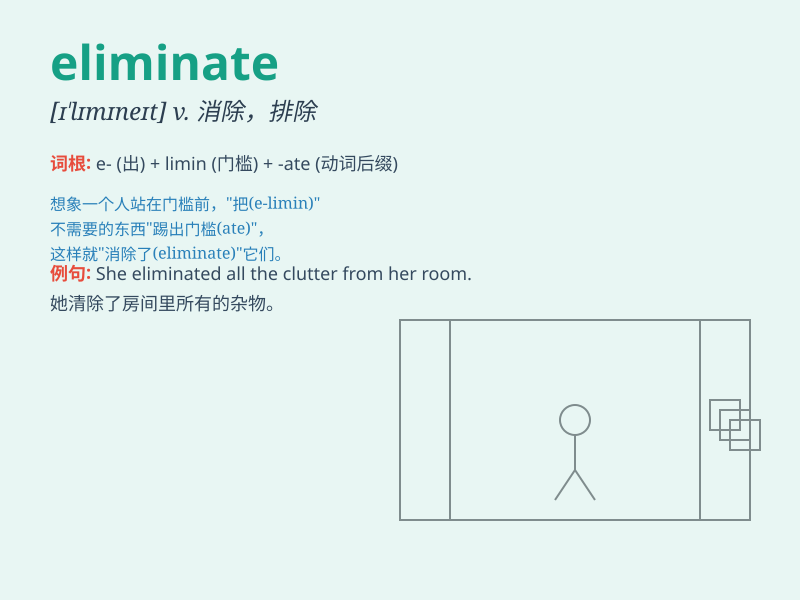

## eliminate

**英音:** _[ɪ\'lɪmɪneɪt]_ **美音:** _[ɪ\'lɪmɪnet]_

**译义:** *vt.排除,消除v.除去*

### 短语

+ **eliminate poverty:** _消除贫困_

+ **eliminate errors:** _消除错误_

+ **eliminate rivals:** _淘汰对手_

+ **eliminate waste:** _消除浪费_

+ **eliminate barriers:** _消除障碍_

### 例句

#### 例句1

> **The new treatment has eliminated the disease completely.**

**中文翻译:** 新疗法完全消除了这种疾病。

**单词释义:** 消除；根除

#### 例句2

> **Our team was eliminated from the competition in the first
round.**

**中文翻译:** 我们队在第一轮比赛中就被淘汰了。

**单词释义:** 淘汰；排除

#### 例句3

> **She tried to eliminate all distractions and focus on her
work.**

**中文翻译:** 她努力排除一切干扰，专注于工作。

**单词释义:** 排除；清除

### 背诵小故事

> A brave warrior was on a mission to eliminate all the evil monsters.
He fought fiercely and one by one, got rid of them. \'Eliminate\' means
to get rid of or remove completely, just like the warrior did to the
monsters.

**一位勇敢的战士肩负着消灭所有邪恶怪物的使命。他激烈战斗，一个接一个地除掉了它们。\'eliminate\'的意思是完全除掉或去除，就像战士对怪物所做的那样。**

### 图义

