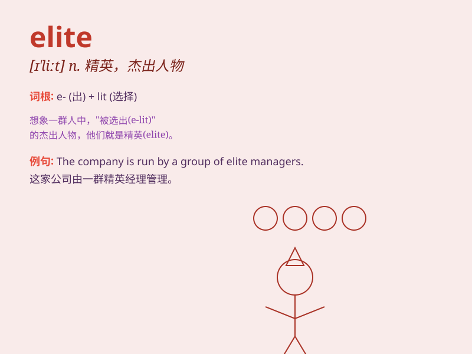

## elite

**英音:** _[[eɪˈliːt]]_ **美音:** _[ɪˈliːt]_

**译义:** *n.\<法>[集合名词]精华,精锐,中坚分子*

### 短语

+ **elite athlete:** _精英运动员_

+ **elite force:** _精锐部队_

+ **elite school:** _精英学校_

+ **social elite:** _社会精英_

+ **elite group:** _精英团体_

### 例句

#### 例句1

> **The elite athletes trained rigorously for the Olympics.**

**中文翻译:** 精英运动员为奥运会进行了严格的训练。

**单词释义:** 精英；杰出人物

#### 例句2

> **She belongs to the social elite of the city.**

**中文翻译:** 她属于这个城市的社会精英。

**单词释义:** 精英；上层人士

#### 例句3

> **The company is staffed by an elite team of experts.**

**中文翻译:** 公司拥有一支精英专家团队。

**单词释义:** 精英；优秀的团队

### 背诵小故事

> Once upon a time, in a kingdom, there was a group of highly skilled
warriors. They were the elite, chosen for their exceptional strength and
bravery. They protected the kingdom and were respected by all. The word
\'elite\' means a select group that is the best of the best.

**从前，在一个王国里，有一群技艺高超的战士。他们是精英，因其非凡的力量和勇敢而被选中。他们保护着王国，受到所有人的尊敬。单词\'elite\'意思是出类拔萃的精选群体。**

### 图义

