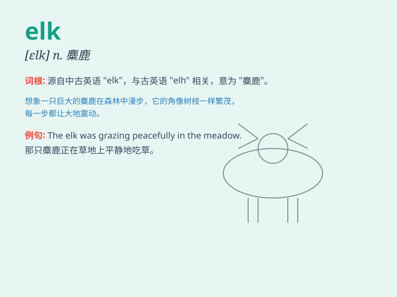

## elk

**英音:** _[elk]_ **美音:** _[ɛlk]_

**译义:** *n.[动]麋鹿,软鞣粗皮*

### 短语

+ **elk herd:** _麋鹿群_

+ **elk antler:** _麋鹿鹿角_

+ **elk hunting:** _猎捕麋鹿_

+ **elk skin:** _麋鹿皮_

+ **elk habitat:** _麋鹿栖息地_

### 例句

#### 例句1

> **I saw an elk in the forest during my hike.**

**中文翻译:** 我徒步旅行时在森林里看到一只麋鹿。

**单词释义:** 麋鹿

#### 例句2

> **The elk is a large and powerful animal.**

**中文翻译:** 麋鹿是一种体型庞大、力量强大的动物。

**单词释义:** 麋鹿

#### 例句3

> **Hunters are not allowed to shoot elks without a license.**

**中文翻译:** 未经许可，猎人不得射杀麋鹿。

**单词释义:** 麋鹿

### 背诵小故事

> One day, while hiking in the forest, I saw an elk. It was huge with
strong antlers. It moved gracefully through the trees. I was so amazed
by its beauty and size. Remember, elk is a large deer!

**有一天，在森林里徒步时，我看到了一头麋鹿。它体型巨大，有着强壮的鹿角。它优雅地在树林间穿梭。我被它的美丽和体型所震撼。记住，elk
就是一种大鹿！**

### 图义

