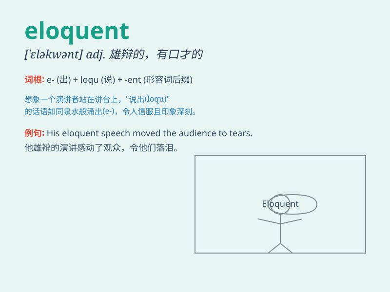

## eloquent

**英音:** _[\'eləkwənt]_ **美音:** _[\'ɛləkwənt]_

**译义:** *adj.雄辩的,有口才的,动人的,意味深长的*

### 短语

+ **eloquent speaker:** _雄辩的演讲者_

+ **eloquent writing:** _动人的文笔_

+ **be eloquent in:** _在\...\...方面有口才_

+ **eloquent testimony:** _有说服力的证词_

+ **eloquent defense:** _雄辩的辩护_

### 例句

#### 例句1

> **She is an eloquent speaker and can captivate the audience with
her words.**

**中文翻译:** 她是一位能言善道的演讲者，能够用她的话语吸引听众。

**单词释义:** 口才好的

#### 例句2

> **The politician gave an eloquent speech about the need for
change.**

**中文翻译:** 这位政治家就变革的必要性发表了雄辩的演讲。

**单词释义:** 有口才的；雄辩的

#### 例句3

> **His letter was so eloquent that it moved me to tears.**

**中文翻译:** 他的信是如此雄辩，使我感动得流下了眼泪。

**单词释义:** 动人的；富有表现力的

### 背诵小故事

> A young man was giving a speech. His words were so fluent and
expressive that everyone was impressed. We called him eloquent. Later,
he became a famous speaker. Remember, eloquent means fluent and
persuasive in speech.

**一个年轻人正在发表演讲。他的言辞如此流畅且富有表现力，每个人都印象深刻。我们称他为口才好的。后来，他成为了一位著名的演讲者。记住，eloquent
意思是言语流利且有说服力的。**

### 图义

