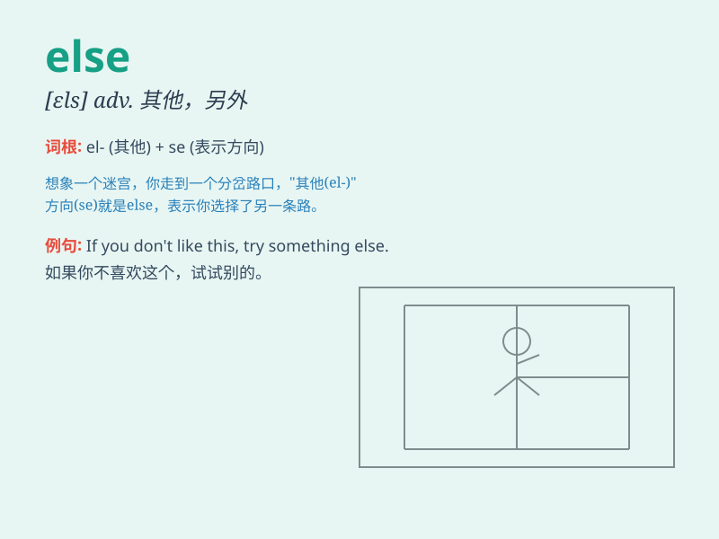

## else

**英音:** _[els]_ **美音:** _[ɛls]_

**译义:** *adj.别的,其他的adv.另外,其他*

### 短语

+ **or else:** _否则；要不然_

+ **something else:** _别的东西_

+ **nothing else:** _没有别的东西_

+ **somebody else:** _别人；其他人_

+ **anybody else:** _任何其他人_

### 例句

#### 例句1

> **I don\'t like this dress. What else can I try?**

**中文翻译:** 我不喜欢这件衣服。我还能尝试什么？

**单词释义:** 别的；其他的

#### 例句2

> **Everyone is here. Where else could he be?**

**中文翻译:** 每个人都在这里。他还能在哪里呢？

**单词释义:** 其他地方

#### 例句3

> **Nothing else matters to me right now.**

**中文翻译:** 现在对我来说没有什么重要的。

**单词释义:** 别的；其他的

### 背诵小故事

> One day, Tom was choosing a present. He saw a book and a pen. But he
didn\'t want them. He thought, \'I need something else.\' Finally, he
found a nice toy car.

**一天，汤姆在挑选礼物。他看到了一本书和一支笔。但他不想要。他想，'我需要别的东西。'最后，他找到了一辆漂亮的玩具车。**

### 图义

