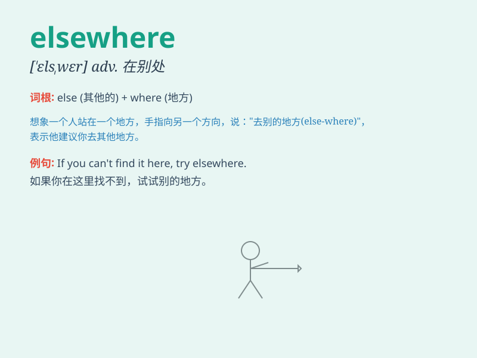

## elsewhere

**英音:** _[ˌelsˈweə(r)]_ **美音:** _[ˌelsˈwer]_

**译义:** *adv.在别处*

### 短语

+ **go elsewhere:** _去别处_

+ **look elsewhere:** _看向别处_

+ **find elsewhere:** _在别处找到_

+ **live elsewhere:** _住在别处_

+ **work elsewhere:** _在别处工作_

### 例句

#### 例句1

> **I couldn\'t find my keys at home. Maybe they are elsewhere.**

**中文翻译:** 我在家找不到钥匙了。也许他们在别处。

**单词释义:** 在别处；到别处

#### 例句2

> **She decided to look for a job elsewhere after she was laid
off.**

**中文翻译:** 下岗后，她决定另谋出路。

**单词释义:** 在其他地方

#### 例句3

> **The best schools are elsewhere, not in this town.**

**中文翻译:** 最好的学校在其他地方，不在这个镇上。

**单词释义:** 在别的地方

### 背诵小故事

> A little rabbit was lost in the forest. It searched everywhere but
couldn\'t find its home. Then it thought maybe its home was elsewhere
and started to look in a new direction. Finally, it found its way.

**一只小兔子在森林里迷路了。它到处找但都找不到家。然后它想也许它的家在别处，于是开始朝新的方向寻找。最后，它找到了回家的路。**

### 图义

