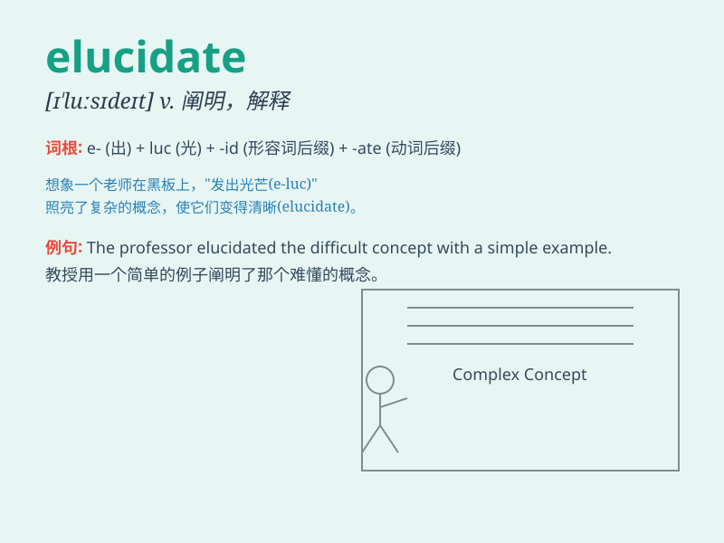

## elucidate

**英音:** _[ɪ\'l(j)uːsɪdeɪt]_ **美音:** _[ɪ\'lusɪdet]_

**译义:** *vt.阐明,说明*

### 短语

+ **elucidate the mystery:** _阐明谜团_

+ **elucidate the problem:** _解释问题_

+ **elucidate the theory:** _阐释理论_

+ **elucidate the truth:** _说明真相_

+ **elucidate one\'s position:** _阐明某人的立场_

### 例句

#### 例句1

> **The professor elucidated the complex theory with simple
examples.**

**中文翻译:** 教授用简单的例子阐明了复杂的理论。

**单词释义:** 阐明；解释

#### 例句2

> **Can you elucidate your point of view further?**

**中文翻译:** 您能进一步阐明您的观点吗？

**单词释义:** 阐明；说明

#### 例句3

> **The detective was trying to elucidate the mystery of the
crime.**

**中文翻译:** 侦探试图揭开这起犯罪案的谜团。

**单词释义:** 解开；说明

### 背诵小故事

> A detective was trying to elucidate a mysterious case. He collected
clues, interviewed witnesses, and finally made everything clear. Just
like explaining difficult things, that\'s what \'elucidate\' means.

**一位侦探试图阐明一起神秘的案件。他收集线索，询问证人，最终让一切都清晰明了。就像解释困难的事情，这就是'elucidate'的意思。**

### 图义

