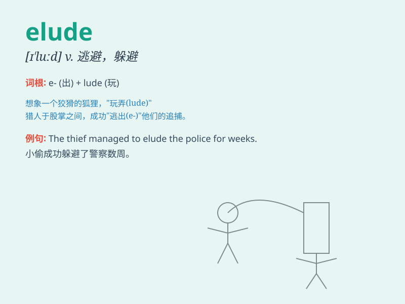

## elude

**英音:** _[ɪ\'l(j)uːd]_ **美音:** _[ɪ\'lud]_

**译义:** *v.躲避*

### 短语

+ **elude capture:** _逃避捕获_

+ **elude understanding:** _难以理解_

+ **elude pursuit:** _躲避追踪_

+ **elude detection:** _避开侦查_

+ **elude memory:** _从记忆中消失_

### 例句

#### 例句1

> **The thief eluded the police for weeks.**

**中文翻译:** 小偷躲了警察好几个星期。

**单词释义:** 逃避；躲避

#### 例句2

> **The answer continues to elude me.**

**中文翻译:** 我仍然无法找到答案。

**单词释义:** 使无法得到；使无法理解

#### 例句3

> **She managed to elude her pursuers in the dark.**

**中文翻译:** 她在黑暗中设法躲避了追捕者。

**单词释义:** 摆脱；避开

### 背诵小故事

> A thief was trying to elude the police. He ran through alleys and hid
in dark corners, but the police were determined. Finally, they caught
him. \'Elude\' means to escape or avoid by being tricky.

**一个小偷试图躲避警察。他穿过小巷，躲在黑暗的角落，但警察很坚决。最后，他们抓住了他。\'elude\'意思是通过巧妙的方式逃脱或避开。**

### 图义

