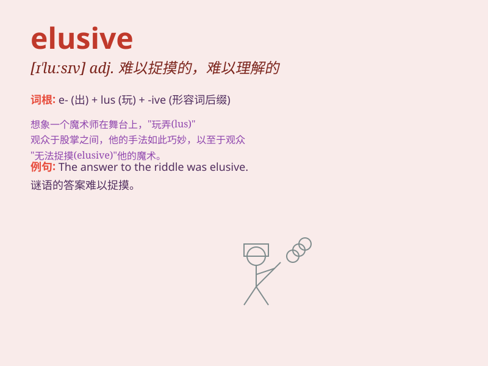

## elusive

**英音:** _[ɪ\'l(j)uːsɪv]_ **美音:** _[ɪ\'lusɪv]_

**译义:** *adj.难懂的,难捉摸的,易忘的*

### 短语

+ **elusive dream:** _难以实现的梦想_

+ **elusive target:** _难以捉摸的目标_

+ **elusive answer:** _难以得到的答案_

+ **elusive quality:** _难以描述的特质_

+ **elusive figure:** _难以看清的身影_

### 例句

#### 例句1

> **The thief was elusive and managed to escape the police.**

**中文翻译:** 小偷神出鬼没，设法逃脱了警察的追捕。

**单词释义:** 难以捉摸的；难以捕获的

#### 例句2

> **Happiness can be elusive for some people.**

**中文翻译:** 对于某些人来说，幸福可能是难以捉摸的。

**单词释义:** 难以得到的；难以实现的

#### 例句3

> **The answer to this complex problem is elusive.**

**中文翻译:** 这个复杂问题的答案是难以捉摸的。

**单词释义:** 难以找到的；难以发现的

### 背诵小故事

> A thief was always elusive in the city. The police tried many times
to catch him but failed. He seemed to disappear like a ghost. Finally,
they found a clue and caught the elusive thief.

**一个小偷在城市里总是难以捉摸。警察多次试图抓住他但都失败了。他似乎像幽灵一样消失。最后，他们找到了线索并抓住了这个难以捉摸的小偷。**

### 图义

