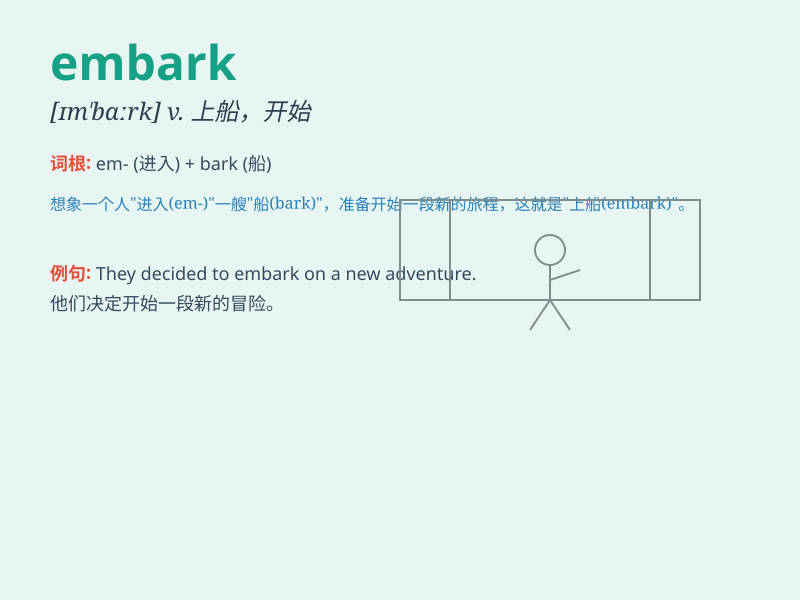

## embark

**英音:** _[ɪm\'bɑːk; em-]_ **美音:** _[ɪm\'bɑrk]_

**译义:** *v.上船,上飞机,着手,从事,装于船上,登上*

### 短语

+ **embark on:** _开始，着手_

+ **embark upon:** _从事，着手_

+ **embark for:** _乘船前往_

+ **embark in:** _参与_

+ **embark with:** _带着\...\...开始_

### 例句

#### 例句1

> **He embarked on a new career as a software engineer.**

**中文翻译:** 他作为一名软件工程师开始了新的职业生涯。

**单词释义:** 开始从事，着手

#### 例句2

> **The passengers embarked the ship at the port.**

**中文翻译:** 乘客们在港口登船。

**单词释义:** 上船；登机

#### 例句3

> **She embarked on a difficult journey without hesitation.**

**中文翻译:** 她义无反顾地踏上了艰难的旅程。

**单词释义:** 踏上（征程）

### 背诵小故事

> 想象一下，一位勇敢的探险家站在一艘大船的甲板上。他深吸一口气，embark
了他的冒险之旅。他满怀期待，因为这一旅程将带他去探索未知的世界。

**想象一位勇敢的探险家站在大船甲板上，深吸一口气，开始了他的冒险之旅。这里的
embark 就是开始、着手的意思。**

### 图义

