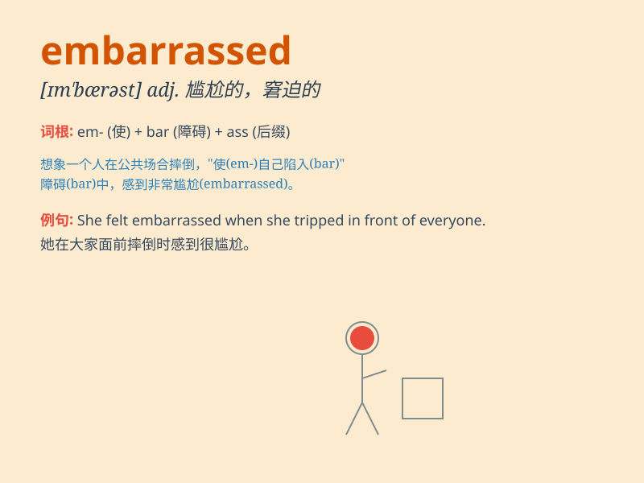

## embarrassed

**英音:** _[ɪmˈbærəst]_ **美音:** _[ɪmˈbærəst]_

**译义:** *adj.尴尬的；窘迫的；为难的；局促不安的*

### 短语

+ **be embarrassed about:** _对\...\...感到尴尬_

+ **feel embarrassed:** _感到尴尬_

+ **embarrassed expression:** _尴尬的表情_

+ **embarrassed silence:** _尴尬的沉默_

+ **embarrassed look:** _尴尬的神情_

### 例句

#### 例句1

> **She felt embarrassed when she tripped and fell in public.**

**中文翻译:** 她在公共场合绊倒并摔倒时感到很尴尬。

**单词释义:** 感到尴尬的

#### 例句2

> **He looked embarrassed at his mistake.**

**中文翻译:** 他因自己的错误看起来很尴尬。

**单词释义:** 尴尬的；窘迫的

#### 例句3

> **I was so embarrassed that I couldn\'t say a word.**

**中文翻译:** 我太尴尬了以至于说不出一个字。

**单词释义:** 感到难为情的

### 背诵小故事

> One day, I wore the wrong clothes to a party and everyone stared at
me. I felt so embarrassed. It was like being in a spotlight with no
place to hide. My face turned red and I just wanted to disappear.

**有一天，我穿错衣服去参加派对，每个人都盯着我看。我感到非常尴尬。就好像置身于聚光灯下无处可藏。我的脸变红了，只想消失。**

### 图义

