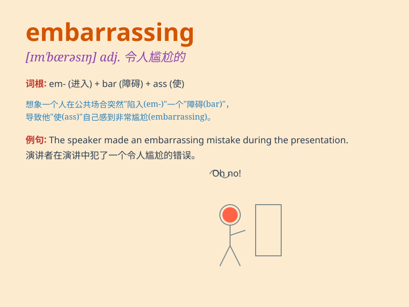

## embarrassing

**英音:** _[ɪmˈbærəsɪŋ]_ **美音:** _[ɪmˈbærəsɪŋ]_

**译义:** *adj. 令人尴尬的，令人难堪的*

### 短语

+ **an embarrassing situation:** _令人尴尬的情况_

+ **embarrassing moment:** _尴尬的时刻_

+ **embarrassing mistake:** _令人尴尬的错误_

+ **embarrassing question:** _令人尴尬的问题_

+ **embarrassing silence:** _令人尴尬的沉默_

### 例句

#### 例句1

> **It was an embarrassing situation for all of us.**

**中文翻译:** 这对我们所有人来说都是一个尴尬的局面。

**单词释义:** 令人尴尬的

#### 例句2

> **His behavior at the party was really embarrassing.**

**中文翻译:** 他在聚会上的行为真的很令人尴尬。

**单词释义:** 令人尴尬的

#### 例句3

> **She told an embarrassing story that made everyone laugh.**

**中文翻译:** 她讲了一个令人尴尬的故事，让大家都笑了。

**单词释义:** 令人尴尬的

### 背诵小故事

> I had an embarrassing moment at the party. I tripped and spilled my
drink all over the floor. Everyone stared at me, and I felt my face turn
red. The situation was truly embarrassing.

**我在聚会上有个尴尬的时刻。我绊了一跤，把饮料洒了一地。每个人都盯着我，我感觉脸都红了。这情况真的很令人尴尬。**

### 图义

