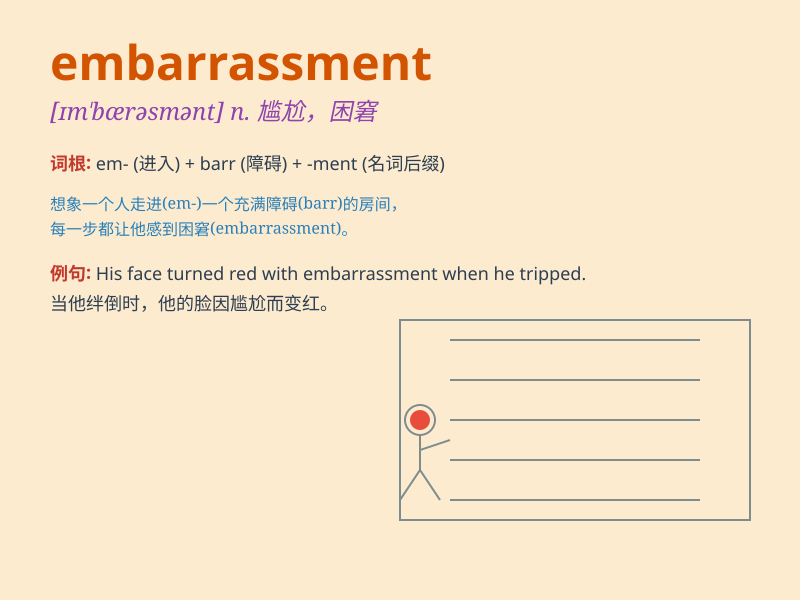

## embarrassment

**英音:** _[ɪm\'bærəsmənt; em-]_ **美音:**
_[ɪm\'bærəsmənt]_

**译义:** *n.困窘,阻碍*

### 短语

+ **social embarrassment:** _社交尴尬_

+ **financial embarrassment:** _财务困境_

+ **cause embarrassment:** _引起尴尬_

+ **feel embarrassment:** _感到尴尬_

+ **avoid embarrassment:** _避免尴尬_

### 例句

#### 例句1

> **His face turned red with embarrassment when he made a
mistake.**

**中文翻译:** 当他犯错时，他的脸羞得通红。

**单词释义:** 尴尬；难堪

#### 例句2

> **She felt a great deal of embarrassment at being the center of
attention.**

**中文翻译:** 成为众人瞩目的焦点，她感到非常尴尬。

**单词释义:** 尴尬；难为情

#### 例句3

> **The incident caused him a lot of embarrassment in public.**

**中文翻译:** 这件事让他在公共场合感到非常尴尬。

**单词释义:** 尴尬；窘迫

### 背诵小故事

> One day, I wore the wrong clothes to a party and everyone stared at
me. I felt a deep sense of embarrassment. It was like a spotlight
shining on my mistake and I just wanted to hide.

**有一天，我穿错衣服去参加聚会，每个人都盯着我看。我感到极度的尴尬。就好像聚光灯照在我的错误上，我只想躲起来。**

### 图义

