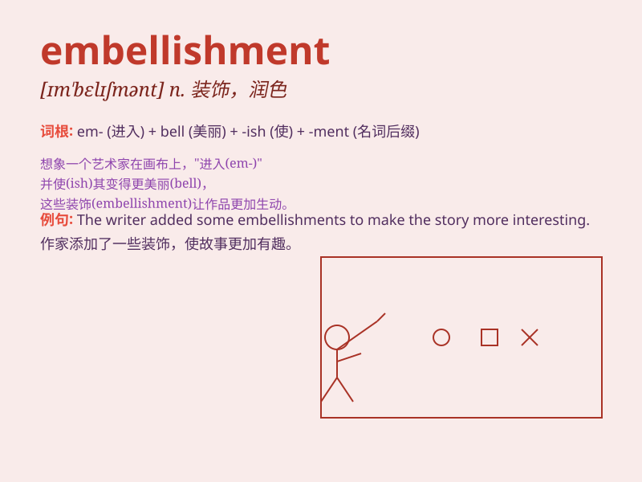

## embellishment

**英音:** _[ɪm\'belɪʃmənt]_ **美音:** _[ɪm\'bɛlɪʃmənt]_

**译义:** *n.装饰,修饰,润色*

### 短语

+ **architectural embellishment:** _建筑装饰_

+ **ornamental embellishment:** _装饰性点缀_

+ **textual embellishment:** _文本修饰_

+ **minor embellishment:** _小的修饰_

+ **visual embellishment:** _视觉装饰_

### 例句

#### 例句1

> **The dress had beautiful embellishments of pearls and lace.**

**中文翻译:** 这件衣服有美丽的珍珠和蕾丝装饰。

**单词释义:** 装饰；修饰

#### 例句2

> **His story was full of unnecessary embellishments.**

**中文翻译:** 他的故事充满了不必要的修饰。

**单词释义:** 添枝加叶；渲染

#### 例句3

> **The architect added some embellishments to the building\'s
design.**

**中文翻译:** 建筑师在建筑物的设计中添加了一些装饰。

**单词释义:** 装饰；美化

### 背诵小故事

> A poor painter was always sad about his plain works. One day, he
discovered the magic of embellishment. By adding some beautiful details
and colors, his paintings became wonderful and attracted many people.
Now you know, embellishment means making something more beautiful.

**一个贫穷的画家总是为他平淡的作品感到难过。有一天，他发现了装饰美化的魔力。通过添加一些美丽的细节和色彩，他的画变得精彩并吸引了很多人。现在你知道了，embellishment
意思是装饰，美化。**

### 图义

