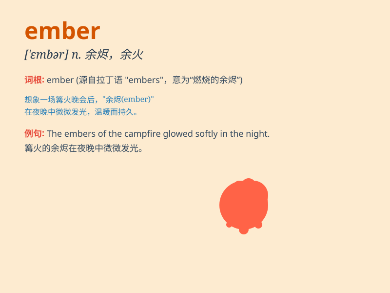

## ember

**英音:** _[\'embə]_ **美音:** _[\'ɛmbɚ]_

**译义:** *n.灰烬,余烬*

### 短语

+ **ember days:** _（天主教）四季斋期_

+ **live ember:** _燃烧的余烬_

+ **glowing ember:** _灼热的余烬_

+ **dying ember:** _即将熄灭的余烬_

+ **embers of hope:** _希望的余烬_

### 例句

#### 例句1

> **The embers of the fire glowed in the darkness.**

**中文翻译:** 火的余烬在黑暗中闪闪发光。

**单词释义:** 余烬；小火苗

#### 例句2

> **She blew on the embers to reignite the fire.**

**中文翻译:** 她向余烬吹气，以重新点燃火。

**单词释义:** 余烬

#### 例句3

> **The embers still held a hint of warmth.**

**中文翻译:** 余烬中还残留着一丝温暖。

**单词释义:** 余烬

### 背诵小故事

> A forest fire was put out. But there were still some embers glowing
under the ashes. A little bird was very careful and used water to cool
them down. The embers were the last remains of the fire.

**一场森林大火被扑灭了。但灰烬下仍有一些余烬在发光。一只小鸟非常小心，用水把它们浇凉。余烬就是火的最后残余。**

### 图义

