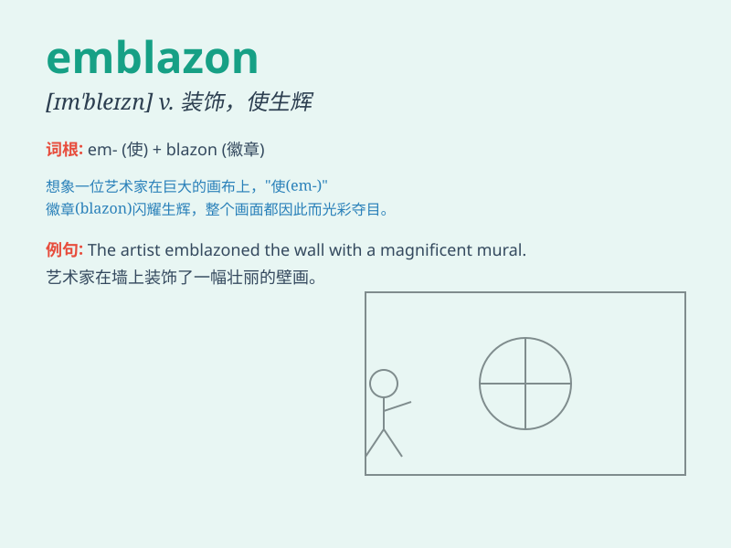

## emblazon

**英音:** _[ɪm\'bleɪz(ə)n; em-]_ **美音:** _[ɪm\'blezn]_

**译义:** *vt.用纹章装饰,颂扬,盛饰*

### 短语

+ **emblazon with:** _用......装饰；在......上印上醒目的标记_

+ **emblazon on:** _把......印在；把......显著地展示在_

+ **emblazon sth in one\'s mind:** _把某事深深地印在某人的脑海中_

+ **emblazon a banner:** _在旗帜上绘制醒目的图案_

+ **emblazon a story:** _使一个故事广为流传_

### 例句

#### 例句1

> **The team\'s logo was emblazoned on the jerseys.**

**中文翻译:** 球衣上印有球队的标志。

**单词释义:** 醒目地印上；装饰

#### 例句2

> **Her name was emblazoned across the banner.**

**中文翻译:** 她的名字印在横幅上。

**单词释义:** 醒目地展示；使显著

#### 例句3

> **The knight\'s shield was emblazoned with a golden cross.**

**中文翻译:** 骑士的盾牌上刻有金色的十字架。

**单词释义:** 装饰；铭刻

### 背诵小故事

> In a magical forest, a brave knight emblazoned his shield with a
unique symbol to show his identity. It made him stand out and be easily
recognized. The act of emblazoning made his shield shine bright.

**在一个神奇的森林里，一位勇敢的骑士在他的盾牌上绘制了一个独特的符号来表明他的身份。这让他脱颖而出，很容易被认出。绘制这个动作就是\'emblazon\'。**

### 图义

