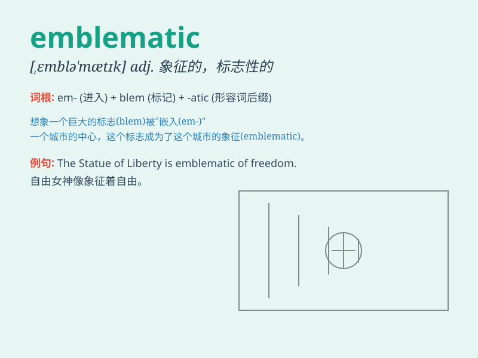

## emblematic

**英音:** _[,emblə\'mætɪk]_ **美音:** _[,ɛmblə\'mætɪk]_

**译义:** *adj.象征(性),标记的*

### 短语

+ **emblematic figure:** _象征性人物_

+ **emblematic symbol:** _象征符号_

+ **emblematic image:** _标志性形象_

+ **emblematic meaning:** _象征意义_

+ **emblematic feature:** _典型特征_

### 例句

#### 例句1

> **The dove is emblematic of peace.**

**中文翻译:** 鸽子是和平的象征。

**单词释义:** 象征的；作为象征的

#### 例句2

> **This building is emblematic of the city\'s architectural
style.**

**中文翻译:** 这座建筑是这座城市建筑风格的象征。

**单词释义:** 作为象征的；典型的

#### 例句3

> **The red rose is emblematic of love and passion.**

**中文翻译:** 红玫瑰是爱与激情的象征。

**单词释义:** 象征的

### 背诵小故事

> A king had a special emblem on his robe. This emblem was so unique
that whenever people saw it, they knew it was the king. So, the emblem
became emblematic of the king\'s power and authority.

**一位国王的长袍上有一个特殊的徽章。这个徽章非常独特，每当人们看到它，就知道是国王。所以，这个徽章成为了国王权力和权威的象征。**

### 图义

