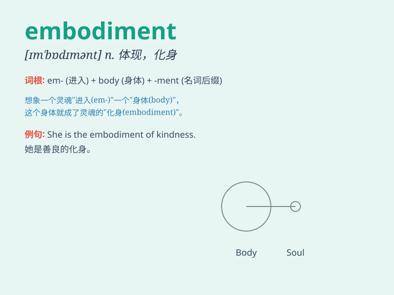

## embodiment

**英音:** _[ɪm\'bɒdɪmənt]_ **美音:** _[ɪm\'bɑdɪmənt]_

**译义:** *n.体现,具体化,化身*

### 短语

+ **the embodiment of:** _是\...\...的体现；是\...\...的化身_

+ **embodiment theory:** _体现理论_

+ **embodiment approach:** _体现方法；具身方法_

+ **embodiment principle:** _体现原则_

+ **embodiment concept:** _体现概念_

### 例句

#### 例句1

> **The new building is the embodiment of modern design.**

**中文翻译:** 新建筑是现代设计的体现。

**单词释义:** 体现；化身

#### 例句2

> **She is the perfect embodiment of kindness and compassion.**

**中文翻译:** 她是善良和同情心的完美体现。

**单词释义:** 化身；典型

#### 例句3

> **This law is an embodiment of the public\'s will.**

**中文翻译:** 这部法律是公众意志的体现。

**单词释义:** 体现

### 背诵小故事

> A magical spirit was looking for a way to exist in the real world.
Finally, it found a human body and entered it. This human became the
embodiment of the spirit, showing all its powers and traits.

**一个神奇的精灵正在寻找在现实世界存在的方式。最终，它找到了一个人类身体并进入其中。这个人就成了精灵的化身，展现出精灵所有的力量和特质。**

### 图义

