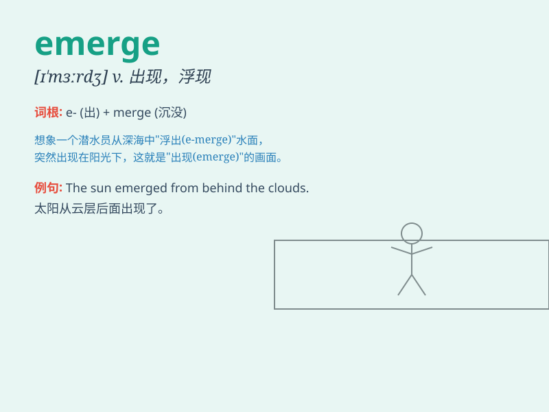

## emerge

**英音:** _[ɪ\'mɜːdʒ]_ **美音:** _[ɪ\'mɝdʒ]_

**译义:** *vi.显现,浮现,暴露,形成,(由某种状态)脱出,(事实)显现出来*

### 短语

+ **emerge from:** _从\...出现；从\...显露出来_

+ **emerge as:** _以\...身份出现；成为\..._

+ **emerge victorious:** _获胜；取得胜利_

+ **emerge unscathed:** _安然无恙地出现_

+ **emerge into:** _逐渐进入（某种状态或情况）_

### 例句

#### 例句1

> **The sun emerged from behind the clouds.**

**中文翻译:** 太阳从云层后面出现了。

**单词释义:** 出现；露出

#### 例句2

> **New evidence has emerged in the case.**

**中文翻译:** 此案出现了新的证据。

**单词释义:** 浮现；显现

#### 例句3

> **After the long war, a new political order emerged.**

**中文翻译:** 长期战争结束后，新的政治秩序出现了。

**单词释义:** 形成；兴起

### 背诵小故事

> 想象一只小蝴蝶在茧里努力挣扎。终于，它成功打破束缚，emerged
出来，展开美丽的翅膀飞向天空。小蝴蝶从茧中出现的过程，就像 emerge
这个词所表达的'出现；浮现'的意思。

**想象一只小蝴蝶在茧里努力挣扎。终于，它成功打破束缚，出现出来，展开美丽的翅膀飞向天空。小蝴蝶从茧中出现的过程，就像
emerge 这个词所表达的'出现；浮现'的意思。**

### 图义

