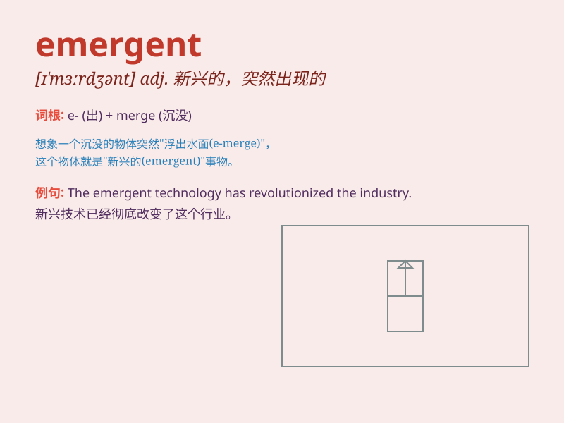

## emergent

**英音:** _[ɪ\'mɜːdʒ(ə)nt]_ **美音:** _[ɪ\'mɝdʒənt]_

**译义:** *adj.紧急的,浮现的,突然出现的,自然发生的*

### 短语

+ **emergent situation:** _紧急情况_

+ **emergent phenomenon:** _新兴现象_

+ **emergent treatment:** _紧急治疗_

+ **emergent light:** _出射光_

+ **emergent properties:** _突现性质_

### 例句

#### 例句1

> **The emergent technology has revolutionized the communication
industry.**

**中文翻译:** 新兴技术彻底改变了通信行业。

**单词释义:** 新兴的

#### 例句2

> **In an emergent situation, quick decisions are crucial.**

**中文翻译:** 在紧急情况下，快速决策至关重要。

**单词释义:** 紧急的

#### 例句3

> **The emergent leader showed great potential in handling the
crisis.**

**中文翻译:** 这位新兴领导人在处理危机方面表现​​出了巨大的潜力。

**单词释义:** 新出现的

### 背诵小故事

> A man was lost in a dark forest. Suddenly, he saw an emergent light.
It was a lantern carried by a kind rescuer. The light gave him hope and
showed him the way out. \'Emergent\' means appearing suddenly and
unexpectedly.

**一个男人在黑暗的森林里迷路了。突然，他看到了一道出现的光。那是一个善良的救援者拿着的灯笼。这道光给了他希望，并为他指明了出路。\'emergent\'意思是突然意外地出现。**

### 图义

