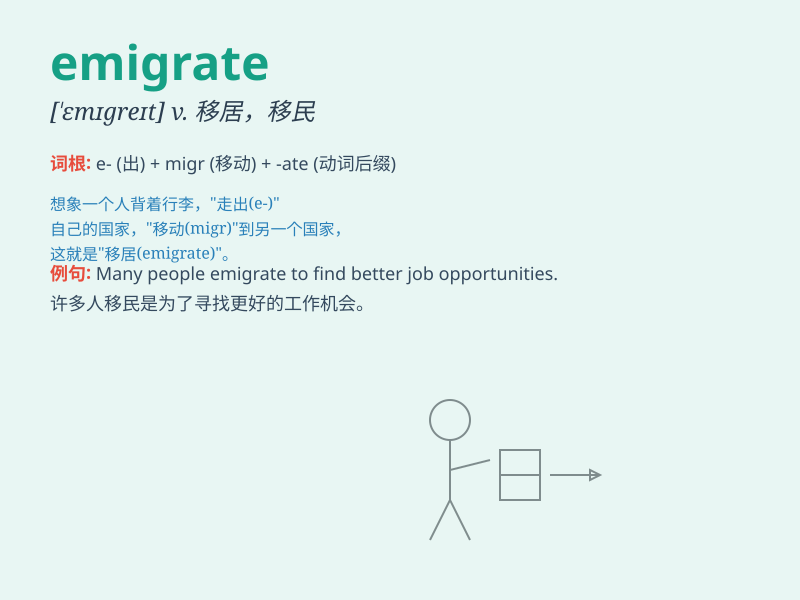

## emigrate

**英音:** _[\'emɪgreɪt]_ **美音:** _[\'ɛmɪɡret]_

**译义:** *vi.永久(使)移居vt.(使)移民*

### 短语

+ **emigrate from:** _从\...移民_

+ **emigrate to:** _移民到\..._

+ **emigrate abroad:** _移民到国外_

+ **emigrate permanently:** _永久移民_

+ **emigrate illegally:** _非法移民_

### 例句

#### 例句1

> **He decided to emigrate to Australia for a better life.**

**中文翻译:** 为了更好的生活，他决定移民到澳大利亚。

**单词释义:** 移民（指离开自己的国家并定居在另一个国家）

#### 例句2

> **Many people emigrate from poor countries to rich ones in search
of job opportunities.**

**中文翻译:** 许多人从贫穷国家移民到富裕国家寻找工作机会。

**单词释义:** 移民

#### 例句3

> **She was forced to emigrate due to the war.**

**中文翻译:** 由于战争，她被迫移居国外。

**单词释义:** 移民

### 背诵小故事

> A brave man decided to emigrate. He left his homeland, saying goodbye
to familiar scenes. He packed his bags, full of dreams and hopes, to
start a new life in a foreign land.

**一位勇敢的人决定移民。他离开了自己的祖国，告别了熟悉的景象。他收拾好行李，怀揣着梦想和希望，去异国他乡开始新的生活。**

### 图义

