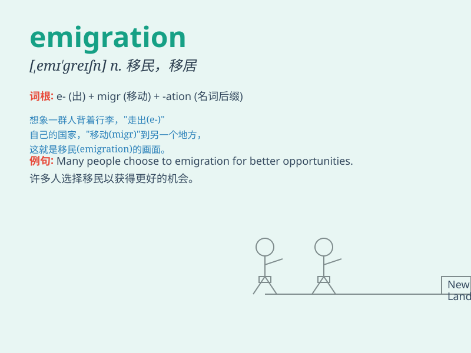

## emigration

**英音:** _[,emɪ\'greɪʃn]_ **美音:** _[,ɛmə\'greʃən]_

**译义:** *n.移民出境,侨居,[总称]移民*

### 短语

+ **emigration policy:** _移民政策_

+ **emigration trend:** _移民趋势_

+ **emigration process:** _移民过程_

+ **emigration rate:** _移民率_

+ **emigration control:** _移民控制_

### 例句

#### 例句1

> **Emigration from the country has increased in recent years.**

**中文翻译:** 近年来，来自该国的移民有所增加。

**单词释义:** 移民出境

#### 例句2

> **His emigration was due to the lack of job opportunities.**

**中文翻译:** 他的移民是由于缺乏工作机会。

**单词释义:** 移民出境

#### 例句3

> **The government is trying to control emigration to maintain the
workforce.**

**中文翻译:** 政府正试图控制移民以维持劳动力。

**单词释义:** 移民出境

### 背诵小故事

> A group of people were very unhappy in their hometown. They decided
to leave and find a better place to live. This act of leaving their
country to live elsewhere is called emigration.

**有一群人在他们的家乡过得很不开心。他们决定离开，去寻找更好的生活之地。这种离开自己的国家去其他地方生活的行为就叫做移民出境。**

### 图义

