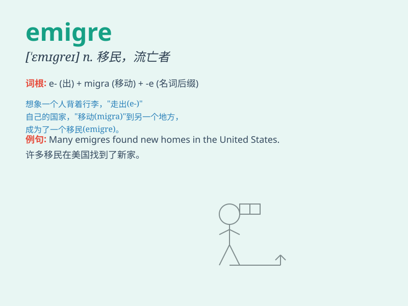

## emigre

**英音:** _[ˈɛmɪgreɪ]_ **美音:** _[\'emɪgre]_

**译义:** *n.移居者(尤指因政治因素而移居外国者),流亡者*

### 短语

+ **emigre community:** _移民社区_

+ **emigre status:** _移民身份_

+ **emigre family:** _移民家庭_

+ **emigre policy:** _移民政策_

+ **emigre experience:** _移民经历_

### 例句

#### 例句1

> **The emigre struggled to adapt to the new culture in the foreign
country.**

**中文翻译:** 流亡者努力适应异国的新文化。

**单词释义:** 移民

#### 例句2

> **Many emigres left their homeland due to political unrest.**

**中文翻译:** 许多移民因政治动荡而离开家园。

**单词释义:** 移民

#### 例句3

> **The emigre fondly recalled the memories of his hometown.**

**中文翻译:** 流亡者深情地回忆起家乡的往事。

**单词释义:** 移民

### 背诵小故事

> A talented artist, feeling oppressed in his homeland, decided to
become an emigre. He packed his bags, left with hope, and sought a new
life abroad, where he could freely pursue his art.

**一位有才华的艺术家，在祖国感到压抑，决定成为一名移居国外者。他收拾行囊，满怀希望地离开，到国外寻求新生活，在那里他可以自由地追求自己的艺术。**

### 图义

