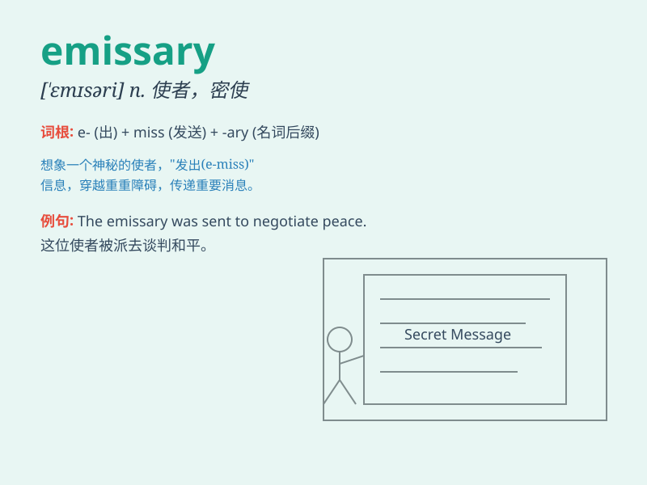

## emissary

**英音:** _[\'emɪs(ə)rɪ]_ **美音:** _[\'ɛmɪsɛri]_

**译义:** *n.使者*

### 短语

+ **emissary mission:** _使者任务_

+ **royal emissary:** _皇家使者_

+ **diplomatic emissary:** _外交使者_

+ **secret emissary:** _秘密使者_

+ **peace emissary:** _和平使者_

### 例句

#### 例句1

> **The king sent an emissary to negotiate peace with the neighboring
country.**

**中文翻译:** 国王派遣使者与邻国进行和平谈判。

**单词释义:** 使者；特使

#### 例句2

> **The company dispatched an emissary to explore new business
opportunities in Asia.**

**中文翻译:** 公司派出特使前往亚洲探索新的商机。

**单词释义:** 使者；代表

#### 例句3

> **He acted as an emissary between the two warring factions.**

**中文翻译:** 他担任两个交战派别之间的使者。

**单词释义:** 使者；中间人

### 背诵小故事

>
想象一下，在古代两个王国之间，有一个神秘的人物总是在夜间穿梭。他肩负着重要的使命，传递着秘密信息，这个人就是
\'emissary\'（使者），是双方沟通的桥梁。

**想象在古代两个王国之间，有个总是在夜间穿梭的神秘人物，肩负重要使命传递秘密信息，这个人就是"使者"，是双方沟通的桥梁。**

### 图义

