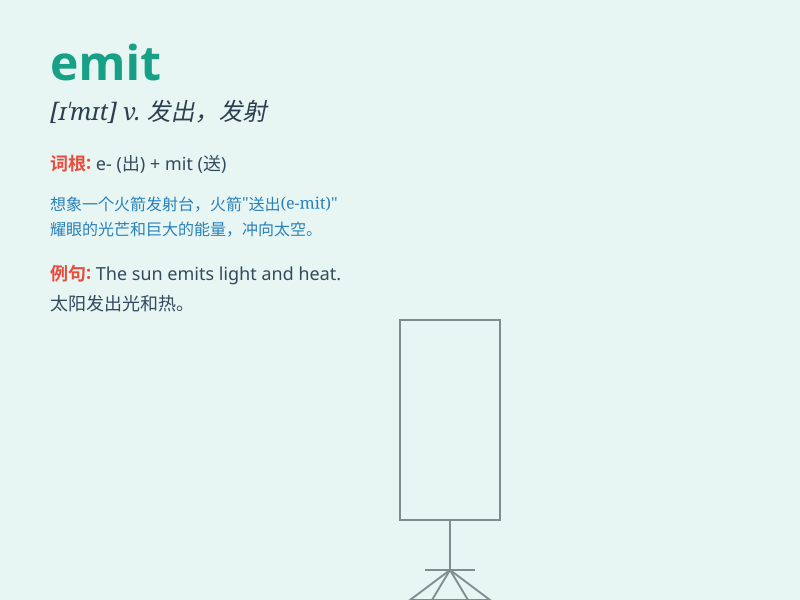

## emit

**英音:** _[ɪ\'mɪt]_ **美音:** _[ɪ\'mɪt]_

**译义:** *vt.发出,放射,吐露,散发,发表,发行*

### 短语

+ **emit light:** _发光_

+ **emit heat:** _发热_

+ **emit sound:** _发声_

+ **emit radiation:** _发射辐射_

+ **emit smoke:** _冒烟_

### 例句

#### 例句1

> **The factory emits a large amount of smoke every day.**

**中文翻译:** 工厂每天排放大量的烟雾。

**单词释义:** 排放

#### 例句2

> **The radio emits signals to communicate with other devices.**

**中文翻译:** 无线电发射信号与其他设备通信。

**单词释义:** 发射

#### 例句3

> **The flower emits a pleasant fragrance.**

**中文翻译:** 这朵花散发出令人愉悦的香味。

**单词释义:** 散发

### 背诵小故事

> 想象一只小蜜蜂在花丛中忙碌，它的尾部不断地
emit（发出）甜甜的蜂蜜，这些蜂蜜散发着诱人的香气。小蜜蜂发出蜂蜜的动作，就像
emit 这个单词所表达的'发出、射出'的意思。

**想象一只小蜜蜂不断发出蜂蜜来辅助记忆 emit
这个单词，意为'发出、射出'。**

### 图义

