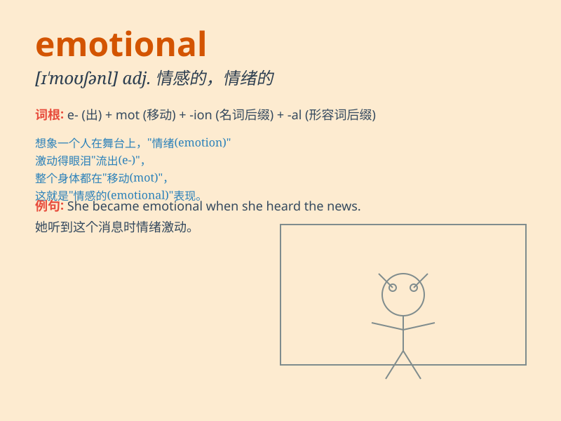

## emotional

**英音:** _[ɪ\'məʊʃ(ə)n(ə)l]_ **美音:** _[ɪ\'moʃənl]_

**译义:** *adj.情绪的,情感的*

### 短语

+ **emotional intelligence:** _情商_

+ **emotional support:** _情感支持_

+ **emotional state:** _情绪状态_

+ **emotional response:** _情绪反应_

+ **emotional trauma:** _情感创伤_

### 例句

#### 例句1

> **She had an emotional breakdown after the loss of her job.**

**中文翻译:** 她在失业后情绪崩溃了。

**单词释义:** 情绪上的；情感的

#### 例句2

> **The movie was very emotional and made many people cry.**

**中文翻译:** 这部电影非常感人，让很多人落泪。

**单词释义:** 引起情感波动的

#### 例句3

> **He is an emotional person and often gets carried away by his
feelings.**

**中文翻译:** 他是个情绪化的人，经常被自己的感情冲昏头脑。

**单词释义:** 感情用事的；易动感情的

### 背诵小故事

> A girl named Lily was always easily moved by touching movies. She
cried and laughed a lot, showing her emotional side. One day, she saw a
film about friendship and was deeply emotional. This shows how emotional
she was.

**一个叫莉莉的女孩总是很容易被感人的电影打动。她经常又哭又笑，展现出她情感丰富的一面。有一天，她看了一部关于友谊的电影，变得非常情绪化。这表明她是多么容易动情。**

### 图义

