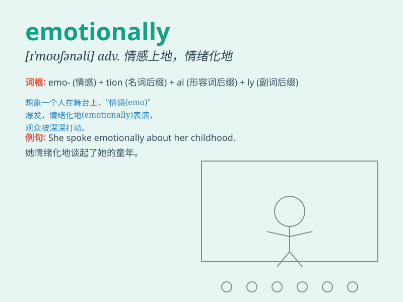

## emotionally

**英音:** _[ɪˈməʊʃənəli]_ **美音:** _[ɪ\'moʃənli]_

**译义:** *adv.在情绪上*

### 短语

+ **emotionally unstable:** _情绪不稳定_

+ **emotionally intelligent:** _情商高的_

+ **emotionally charged:** _充满感情的；情绪激动的_

+ **emotionally attached:** _感情上依恋的_

+ **emotionally exhausted:** _情绪疲惫的_

### 例句

#### 例句1

> **She is emotionally unstable after the breakup.**

**中文翻译:** 分手后，她情绪不稳定。

**单词释义:** 在情绪方面

#### 例句2

> **He responded emotionally rather than logically.**

**中文翻译:** 他的反应是情绪化的，而不是合乎逻辑的。

**单词释义:** 以情感的方式

#### 例句3

> **The movie affected me emotionally.**

**中文翻译:** 这部电影在情感上打动了我。

**单词释义:** 在情感上

### 背诵小故事

> A girl was always emotionally unstable when facing exams. She cried
and laughed easily. But with time and effort, she learned to control her
emotions and became calm. Remember, \'emotionally\' means related to
emotions.

**一个女孩在面对考试时总是情绪不稳定。她很容易哭和笑。但随着时间和努力，她学会了控制自己的情绪，变得冷静。记住，\'emotionally\'意思是与情绪有关。**

### 图义

