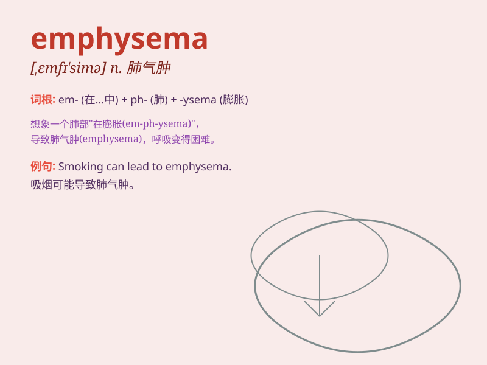

## emphysema

**英音:** _[,emfɪ\'siːmə]_ **美音:** _[\'ɛmfɪ\'simə]_

**译义:** *n.气肿,肺气肿*

### 短语

+ **pulmonary emphysema:** _肺气肿_

+ **emphysema bullae:** _肺气肿泡_

+ **emphysema of lung:** _肺的肺气肿_

+ **obstructive emphysema:** _阻塞性肺气肿_

+ **centrilobular emphysema:** _小叶中心型肺气肿_

### 例句

#### 例句1

> **He was diagnosed with emphysema after years of heavy smoking.**

**中文翻译:** 在多年大量吸烟后，他被诊断出患有肺气肿。

**单词释义:** 肺气肿

#### 例句2

> **Emphysema can severely limit a person\'s ability to breathe.**

**中文翻译:** 肺气肿会严重限制一个人的呼吸能力。

**单词释义:** 肺气肿

#### 例句3

> **The doctor explained that emphysema is a chronic lung
disease.**

**中文翻译:** 医生解释说肺气肿是一种慢性肺病。

**单词释义:** 肺气肿

### 背诵小故事

> A man named Tom always felt short of breath. The doctor diagnosed him
with emphysema. Tom learned that it was a lung disease causing air to
get trapped. He decided to take better care of his health.

**一个叫汤姆的人总是感到呼吸急促。医生诊断他患有肺气肿。汤姆了解到这是一种导致空气滞留肺部的疾病。他决定更好地照顾自己的健康。**

### 图义

