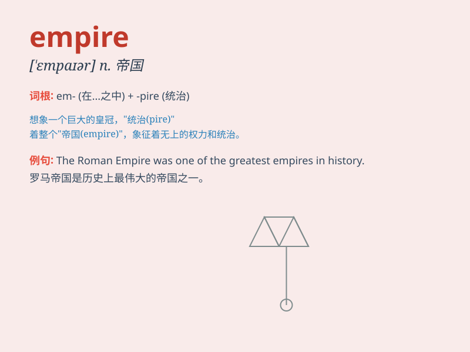

## empire

**英音:** _[\'empaɪə]_ **美音:** _[\'ɛmpaɪr]_

**译义:** *n.帝国,帝权*

### 短语

+ **Roman Empire:** _罗马帝国_

+ **British Empire:** _大英帝国_

+ **empire building:** _建立帝国；扩张势力_

+ **empire state:** _帝国州（美国纽约州的别称）_

+ **empire style:** _帝国风格（指艺术、建筑等方面的风格）_

### 例句

#### 例句1

> **The Roman Empire was one of the most powerful in history.**

**中文翻译:** 罗马帝国是历史上最强大的帝国之一。

**单词释义:** 帝国

#### 例句2

> **He built an empire in the business world through years of hard
work.**

**中文翻译:** 通过多年的努力，他在商界建立了一个帝国。

**单词释义:** 大企业，大集团

#### 例句3

> **The fashion empire she created has taken the world by storm.**

**中文翻译:** 她创建的时尚帝国在全球引起了轰动。

**单词释义:** 庞大的组织，王国

### 背诵小故事

> In a faraway land, a powerful king built a huge territory with many
cities and people. This territory was called an empire. The king ruled
over it with wisdom and strength.

**在一个遥远的地方，一位强大的国王建立了一个有着许多城市和人民的巨大领地。这个领地被称为帝国。国王凭借智慧和力量统治着它。**

### 图义

