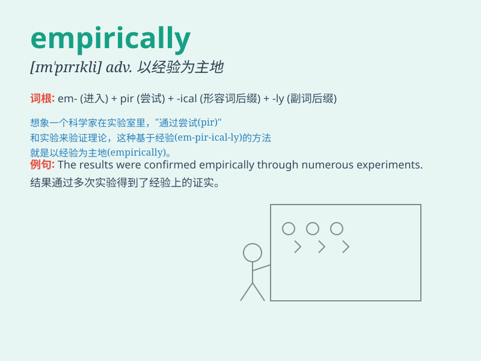

## empirically

**英音:** _[ɪm\'pɪrɪkli]_ **美音:** _[ɪm\'pɪrɪkli]_

**译义:** *adv.以经验为主地*

### 短语

+ **empirically based:** _以经验为基础的_

+ **empirically proven:** _经经验证明的_

+ **empirically supported:** _经验支持的_

+ **empirically investigated:** _经过实证研究的_

+ **empirically determined:** _根据经验确定的_

### 例句

#### 例句1

> **The theory has been empirically verified through numerous
experiments.**

**中文翻译:** 这个理论已经通过大量的实验得到了经验性的验证。

**单词释义:** 以经验为依据地

#### 例句2

> **We need to approach this problem empirically rather than relying
on speculation.**

**中文翻译:** 我们需要以经验的方式来处理这个问题，而不是依靠推测。

**单词释义:** 凭经验地

#### 例句3

> **Empirically, it is found that this method is more effective in
practice.**

**中文翻译:** 从经验上看，发现这种方法在实践中更有效。

**单词释义:** 根据经验

### 背诵小故事

> A scientist was conducting experiments. He collected data
empirically, meaning through direct observation and experience. Every
result was based on real facts, not just theories. This helped him make
accurate conclusions.

**一位科学家正在进行实验。他通过经验主义地收集数据，这意味着通过直接观察和经验。每个结果都基于真实的事实，而不仅仅是理论。这帮助他得出了准确的结论。**

### 图义

