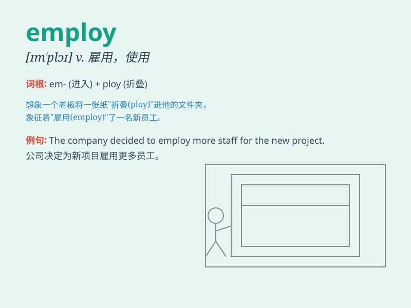

## employ

**英音:** _[ɪm\'plɒɪ; em-]_ **美音:** _[ɪm\'plɔɪ]_

**译义:** *vt.雇用,用,使用v.使用n.雇用*

### 短语

+ **employ oneself in:** _从事于；忙于_

+ **be employed in:** _受雇于；从事于_

+ **employ as:** _把\...用作_

+ **employ force:** _使用武力_

+ **employ somebody to do something:** _雇佣某人做某事_

### 例句

#### 例句1

> **The company employs over 500 people.**

**中文翻译:** 这家公司雇用了 500 多人。

**单词释义:** 雇用

#### 例句2

> **You should employ your time wisely.**

**中文翻译:** 你应该明智地利用时间。

**单词释义:** 利用

#### 例句3

> **The police employed new tactics to catch the thief.**

**中文翻译:** 警方采用了新策略来抓小偷。

**单词释义:** 采用

### 背诵小故事

> A boss was in a hurry to find workers for his new factory. He needed
to employ many people. Finally, he found suitable ones and his business
ran smoothly.

**一位老板着急为他的新工厂找工人。他需要雇用很多人。最终，他找到了合适的人选，他的生意顺利运转。**

### 图义

