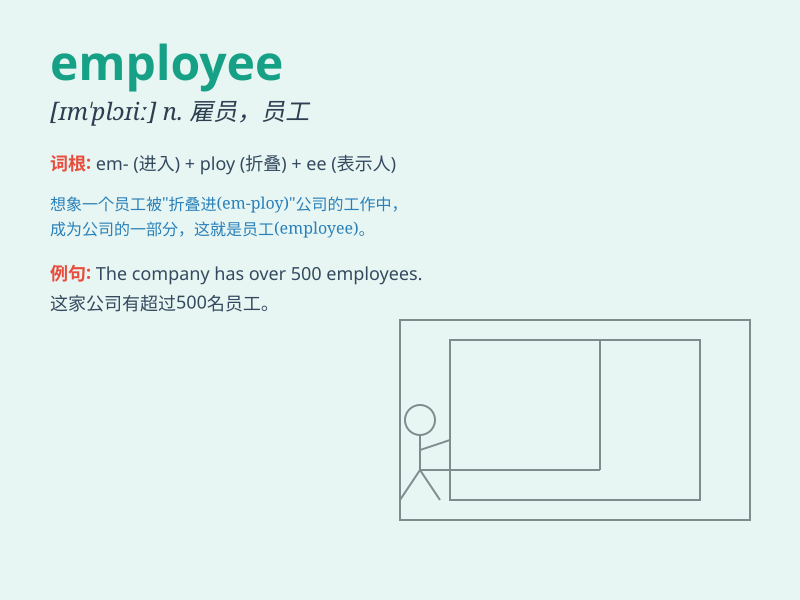

## employee

**英音:** _[ɪmˈplɔɪi;ˌemplɔɪˈi:]_ **美音:**
_[ɪmˈplɔɪi;ɛmplɔɪˈi]_

**译义:** *n.职工,雇员,店员*

### 短语

+ **employee benefits:** _员工福利_

+ **employee training:** _员工培训_

+ **employee turnover:** _员工流动率_

+ **employee performance:** _员工绩效_

+ **employee satisfaction:** _员工满意度_

### 例句

#### 例句1

> **The company has over 500 employees.**

**中文翻译:** 这家公司有超过 500 名员工。

**单词释义:** 员工

#### 例句2

> **She is a hardworking employee.**

**中文翻译:** 她是一名勤奋的员工。

**单词释义:** 员工

#### 例句3

> **The new employee was trained for a week.**

**中文翻译:** 这名新员工接受了一周的培训。

**单词释义:** 员工

### 背诵小故事

> Imagine a big company. There\'s a person named Tom who works there
every day, follows the boss\'s orders, and gets paid. Tom is an
employee. He\'s not the boss but a valuable part of the team.

**想象一家大公司。有一个叫汤姆的人，他每天在那里工作，听从老板的命令，并获得报酬。汤姆就是一名员工。他不是老板，而是团队中有价值的一部分。**

### 图义

