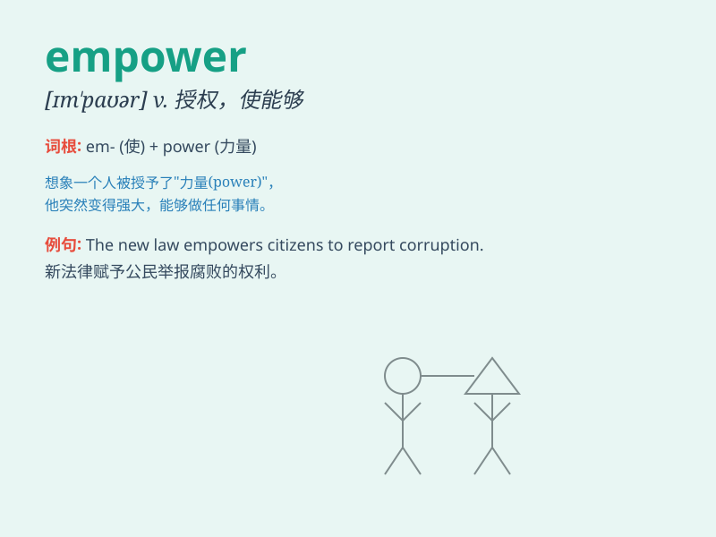

## empower

**英音:** _[ɪm\'paʊə; em-]_ **美音:** _[ɪm\'paʊɚ]_

**译义:** *v.授权与,使能够*

### 短语

+ **empower someone to do something:** _授权某人做某事_

+ **empower oneself:** _使自己有能力_

+ **be empowered:** _被赋予权力_

+ **empower through education:** _通过教育赋予力量_

+ **empower the disadvantaged:** _赋予弱势群体权力_

### 例句

#### 例句1

> **The new law empowers the government to take decisive action.**

**中文翻译:** 新法律赋予政府采取果断行动的权力。

**单词释义:** 赋予\...\...权力

#### 例句2

> **Education empowers individuals to pursue their dreams.**

**中文翻译:** 教育使个人有能力去追求他们的梦想。

**单词释义:** 使有能力

#### 例句3

> **This program is designed to empower women in the workplace.**

**中文翻译:** 这个项目旨在增强职场女性的能力。

**单词释义:** 增强\...\...的能力

### 背诵小故事

> A young artist felt weak and lost. But a wise mentor came and gave
him special skills and confidence, saying \'I empower you to create
amazing art!\' With this new power, the artist became famous. Empower
means to give someone the power or authority to do something.

**一位年轻的艺术家感到虚弱和迷茫。但一位睿智的导师出现了，给了他特殊的技能和信心，说道：'我赋予你力量去创作惊人的艺术！'有了这种新力量，艺术家成名了。empower
意思是赋予某人权力或权威去做某事。**

### 图义

