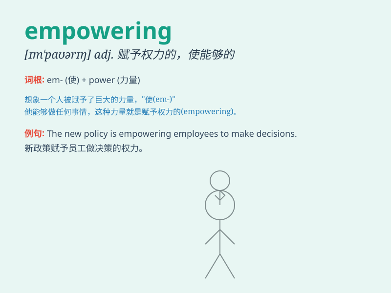

## empowering

**英音:** _[ɪmˈpaʊərɪŋ]_ **美音:** _[ɪmˈpaʊərɪŋ]_

**译义:** *赋予权力的，授权的（该词为 empower
的现在分词形式，意指给予某人权力或能力去做某事）*

### 短语

+ **empowering experience:** _赋予力量的经历_

+ **empowering leadership:** _赋权型领导_

+ **empowering education:** _赋权教育_

+ **empowering women:** _赋予妇女权力_

+ **empowering movement:** _赋权运动_

### 例句

#### 例句1

> **The new law is empowering for small businesses.**

**中文翻译:** 新法律对小企业有赋权作用。

**单词释义:** 赋权；给予力量

#### 例句2

> **This training program is highly empowering for employees.**

**中文翻译:** 这个培训项目对员工非常有激励作用。

**单词释义:** 使有能力；使能够

#### 例句3

> **Her speech was empowering and inspired the audience.**

**中文翻译:** 她的演讲令人振奋，给观众带来了力量。

**单词释义:** 鼓舞；使增强信心

### 背诵小故事

> A young girl was often underestimated. But one day, she joined a
training program that was empowering. Through hard work and new skills,
she became confident and achieved great success. Empowering means giving
someone the power and confidence to succeed.

**一个年轻女孩常被低估。但有一天，她参加了一个赋予力量的培训项目。通过努力和新技能，她变得自信并取得巨大成功。empowering
意思是赋予某人成功的力量和信心。**

### 图义

