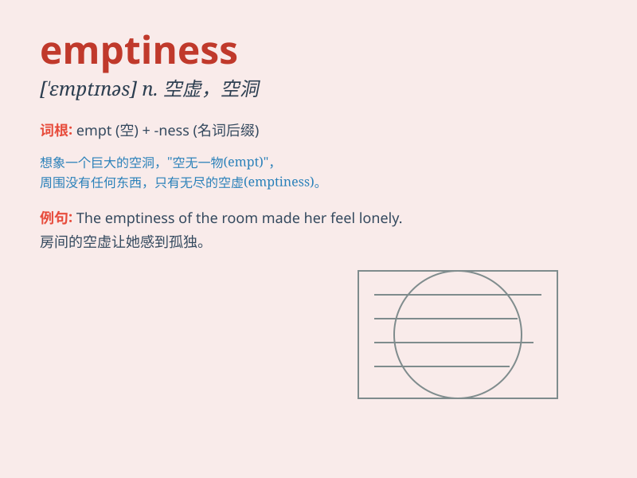

## emptiness

**英音:** _[\'em(p)tɪnɪs]_ **美音:** _[\'ɛmptɪnəs]_

**译义:** *n.空虚,无知*

### 短语

+ **sense of emptiness:** _空虚感_

+ **spiritual emptiness:** _精神空虚_

+ **emptiness inside:** _内心的空虚_

+ **fill the emptiness:** _填补空虚_

+ **emotional emptiness:** _情感空虚_

### 例句

#### 例句1

> **The vast emptiness of the desert made him feel lonely.**

**中文翻译:** 沙漠的广阔空旷让他感到孤独。

**单词释义:** 空旷；空虚

#### 例句2

> **She stared into the emptiness, lost in thought.**

**中文翻译:** 她凝视着空无一物的地方，陷入沉思。

**单词释义:** 空无一物；虚无

#### 例句3

> **The emptiness of his promises became apparent over time.**

**中文翻译:** 随着时间的推移，他那些空洞的承诺变得显而易见。

**单词释义:** 空洞；无实质内容

### 背诵小故事

> A traveler wandered in a vast desert, feeling a sense of emptiness.
There was nothing but sand as far as the eye could see. The lack of
water and company made him understand the true meaning of \'emptiness\'.

**一位旅行者在广袤的沙漠中徘徊，感到一种空虚感。目之所及只有沙子。缺水和无人陪伴让他明白了\'emptiness（空虚）\'的真正含义。**

### 图义

