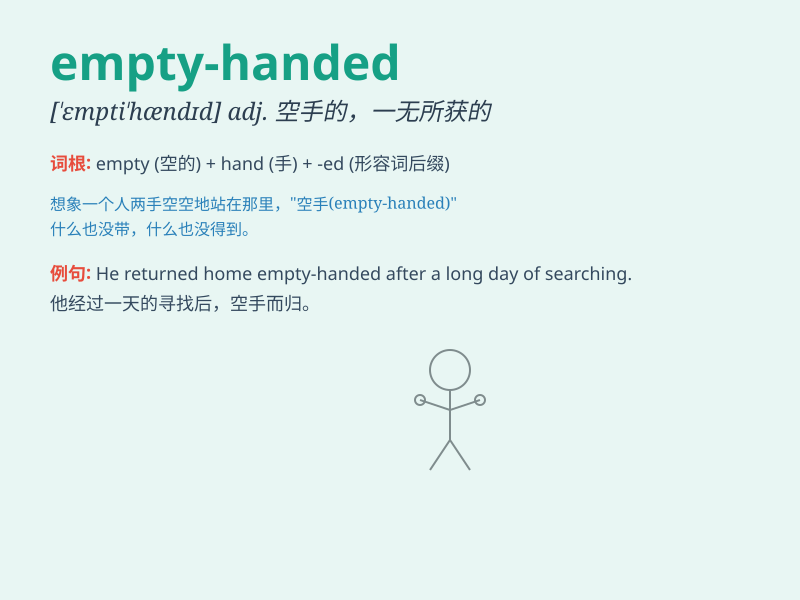

## empty-handed

**英音:** _[ˈɛmpti ˈhændɪd]_ **美音:** _[ˈɛmpti
ˈhændɪd]_

**译义:** *adj. 空手的；徒劳无功的；一无所获的*

### 短语

+ **come away empty-handed:** _一无所获地离开_

+ **go home empty-handed:** _空手回家_

+ **leave empty-handed:** _空手离开_

+ **return empty-handed:** _空手而归_

+ **be left empty-handed:** _被留下两手空空_

### 例句

#### 例句1

> **He returned empty-handed from the shopping trip.**

**中文翻译:** 他购物之旅回来时两手空空。

**单词释义:** 两手空空

#### 例句2

> **The thief left the house empty-handed because the alarm went
off.**

**中文翻译:** 因为警报响起，小偷空手离开了房子。

**单词释义:** 空手

#### 例句3

> **She went to the job interview empty-handed without any relevant
documents.**

**中文翻译:** 她去参加工作面试时两手空空，没有任何相关文件。

**单词释义:** 两手空空

### 背诵小故事

> One day, Tom went to look for treasure. He searched everywhere but
found nothing. Finally, he returned home empty-handed. It means having
nothing in your hands when you expected to have something.

**一天，汤姆去寻宝。他到处寻找但什么也没找到。最后，他空手而归。意思是当你期望有所收获时，手里却什么都没有。**

### 图义

